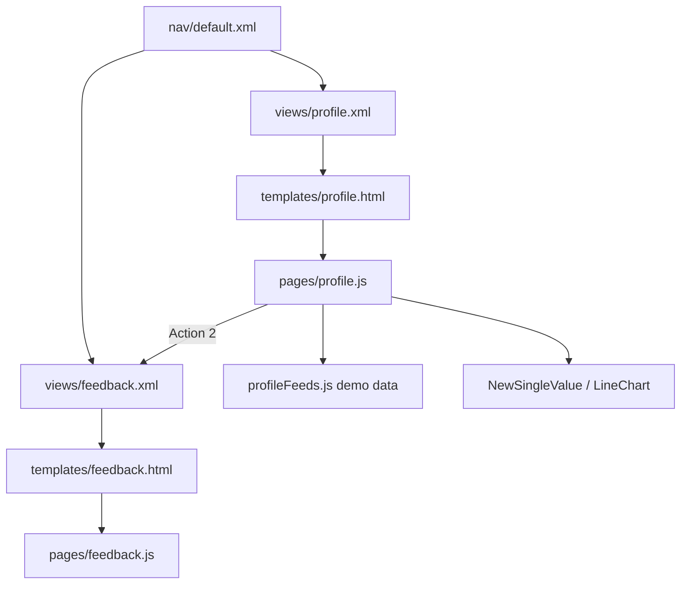

# Profile React App — TDD + Jira Stories

**Status:** Partial implementation (scaffold live; live Splunk data and polish remaining)  
**Last updated:** 2026-08-06  
**App:** `so_BUI_pickulationts`  
**Primary page:** `/app/so_BUI_pickulationts/profile`  
**Related page:** `/app/so_BUI_pickulationts/feedback`  
**Audience:** Engineering, product, QA, Splunk admins

---

## 1. Purpose

This document is the technical design for a Splunk 9.4 React “Profile” experience inside `so_BUI_pickulationts`. It describes:

1. What was built as the first vertical slice.
2. The intended full React app shape (tabs, filters, actions, feedback, theming, data).
3. One Jira epic and the stories needed to finish the entire app.

The Profile page is a Splunk HTML view that loads a Webpack React bundle:

```text
stage/appserver/static/pages/profile.js
```

Feedback is a second HTML view / bundle:

```text
stage/appserver/static/pages/feedback.js
```

---

## 2. Goals

- Deliver a React Profile dashboard that feels native in Splunk Web 9.4.
- Support **Profile** and **Metric** tabs on one page.
- Drive KPI cards and charts from a **filter Select** (All / Region A / Region B initially).
- Provide action buttons with distinct behaviors (modal, internal page, external link).
- Provide a **Feedback** page reachable from Profile actions and app nav.
- Match visualization navy (`#0B1F3B`) as the full page chrome for Profile/Feedback.
- Keep the same packaging pattern as other React pages (`pages/` → Webpack → Mako template → view XML → nav).
- Start with demo feeds; later support Splunk REST searches without changing the UI contract.

## 3. Non-Goals (current phase)

- Replacing Classic Simple XML dashboards (`custom_viz_gallery`, `formatter_cards_94`, etc.).
- Mounting AMD custom viz (`splunkstuff_kpi_sparkline`) inside React panels.
- Production feedback persistence (webhook / KV Store / index) — placeholder form only.
- Final product naming for Action 1 / Action 2 / Action 3 buttons.
- Dark/light Splunk theme switching beyond an explicit navy page override.

---

## 4. Current User Flow

1. Open **Apps → Splunk Stuff (local dev) → Profile**.
2. See header **Profile** with logo on the right, navy full-page background.
3. Switch **Profile** / **Metric** tabs.
4. On Profile tab:
   - Choose **Filter** (All / Region A / Region B) → KPI cards + viz update.
   - **Action 1** opens a modal.
   - **Action 2** navigates to Feedback.
   - **Action 3** opens an external URL (new tab).
5. On Metric tab:
   - **Metric A** navigates to Feedback.
   - **Metric B** opens a modal.
6. On Feedback: enter name/message, Submit (local success message), or **Back to Profile**.
7. Nav also exposes **Resources** (external collection) and **Documentation** (internal React page).

---

## 5. Architecture



### Splunk wiring checklist (per React page)

| Layer | Profile | Feedback |
|-------|---------|----------|
| Webpack entry folder | `src/main/webapp/pages/profile/` | `src/main/webapp/pages/feedback/` |
| View XML | `default/data/ui/views/profile.xml` | `default/data/ui/views/feedback.xml` |
| Mako template | `appserver/templates/profile.html` | `appserver/templates/feedback.html` |
| Nav | `<view name="profile" />` | `<view name="feedback" />` |
| Cache-bust | `?v=` on script in template | same |

**Note:** New views often require Splunk **restart** (or reliable debug/refresh) before they stop 404’ing.

---

## 6. Main Files

| Area | Path |
|------|------|
| Profile entry | `src/main/webapp/pages/profile/index.jsx` |
| Profile styles / layout | `src/main/webapp/pages/profile/ProfileStyles.jsx` |
| Demo feeds (filter-keyed) | `src/main/webapp/pages/profile/profileFeeds.js` |
| Feedback entry | `src/main/webapp/pages/feedback/index.jsx` |
| Profile template | `appserver/templates/profile.html` |
| Feedback template | `appserver/templates/feedback.html` |
| Views | `default/data/ui/views/profile.xml`, `feedback.xml` |
| Nav | `default/data/ui/nav/default.xml` |
| Shared viz components | `src/main/webapp/components/visualizations/NewSingleValue.jsx`, `LineChart.jsx` |

---

## 7. What Was Built (current slice)

### 7.1 Navigation

- **Profile** — React dashboard (default entry for this feature set).
- **Feedback** — React feedback form page.
- **Resources** — `<collection>` of three external links (Splunk 9.4 Docs, Splunk UI, Splunk Dev).
- **Documentation** — existing internal React page (unchanged).

### 7.2 Profile page shell

- Full-page navy background `#0B1F3B` (theme + injected CSS override).
- Header row: **Profile** H1 left, SVG logo mark right.
- `TabBar`: Profile | Metric.

### 7.3 Profile tab

- Toolbar: uppercase **FILTER** label + `Select` (All / Region A / Region B) + `ButtonGroup` of three actions.
- Three summary KPI cards driven by `profileFeeds[filter].cards`.
- Three visualization cards driven by `profileFeeds[filter].viz` (`NewSingleValue` ×2 + `LineChart` ×1).
- Changing filter re-renders cards and charts from the matching feed object.

### 7.4 Metric tab

- Toolbar with Metric A / Metric B buttons.
- Two viz cards from `metricFeeds` (independent of Profile filter).

| Control | Behavior |
|---------|----------|
| Metric A | Navigates to `/app/so_BUI_pickulationts/feedback` |
| Metric B | Opens Splunk React UI `Modal` |

### 7.5 Actions (as of 2026-07-31)

| Control | Behavior |
|---------|----------|
| Action 1 | Opens Splunk React UI `Modal` |
| Action 2 | Navigates to `/app/so_BUI_pickulationts/feedback` |
| Action 3 | External link (`https://dev.splunk.com/`) in new tab |

### 7.6 Feedback page

- Same navy shell + header/logo pattern.
- Name + Feedback fields, Submit → local success `Message`.
- **Back to Profile** link.

### 7.7 Data (current)

Demo-only JavaScript fixtures in `profileFeeds.js`. No Splunk REST searches yet.

---

## 8. Target Full App (remaining design)

These items complete the “entire React app” beyond the scaffold.

### 8.1 Product / UX

- Rename Action 1 / 2 / 3 and Metric A / B to real product labels.
- Replace placeholder logo with brand asset (`appserver/static/…`).
- Finalize Resources URLs and Documentation deep-links.
- Modal content for Action 1 (copy, CTA, optional secondary action).
- Feedback success/error UX and optional confirmation step.

### 8.2 Data layer

- Introduce `useProfileData` (mock vs `?data=splunk`) similar to Risk.
- Map filter tokens → SPL / REST params (region, time range if added).
- Per-panel loading / error / empty states (`PanelShell`-style).
- Optional time range control on Profile toolbar.

### 8.3 Quality

- Unit tests for feed selection by filter key (`yarn test:profile` → `test/profile/profileFeeds.test.mjs`).
- Playwright artifact smoke: `test/playwright/profile-feedback.spec.ts` (stage bundles + view XML + nav).
- Stage verify: `yarn verify:profile-feedback`.
- Manual smoke: Profile loads, filter swaps values, Action 1 modal open/close, Action 2 routes to Feedback, Metric A → Feedback, Metric B modal (see §11 + §11.1 device matrix).
- Cache-bust discipline after every visible JS change (`page_asset_version`).
- Document restart/refresh when adding views.

### 8.4 Accessibility / polish

- Keyboard focus for modal and toolbar.
- Contrast check for navy + muted text.
- Responsive breakpoints (~768px / ~400px): reduced page padding, stacked filter/actions, wrapping action buttons (no `ButtonGroup`), Feedback action column stack, modal `maxWidth: min(480px, calc(100vw - 24px))`.
- Charts use shared `useContainerSize` + LineChart `fillContainer` with `preserveAspectRatio="none"` hover math (`seriesIndexFromPointerNone`) and clamped tooltips.

---

## 9. UI Contract (stable for stories)

### Filter keys

| Value | Label |
|-------|-------|
| `all` | All |
| `region_a` | Region A |
| `region_b` | Region B |

### Feed shape

```js
{
  cards: [{ title, value, delta }],
  viz: [{ subheader, tooltipText, values[], times[] }],
}
```

UI must keep working if mock feeds are replaced by Splunk-mapped objects of the same shape.

---

## 10. Build / Deploy / Cache

1. Edit sources under `pages/profile` or `pages/feedback`.
2. `yarn build` from `packages/splunk-one` (or `yarn start` watch).
3. Bump `page_asset_version` in the matching Mako template.
4. Ensure app symlink: `$SPLUNK_HOME/etc/apps/so_BUI_pickulationts` → `stage`.
5. After **new** views/nav: restart Splunk Web (or debug/refresh) then hard-refresh browser.
6. Verify URLs (note app id spelling: `so_BUI_pickulationts`):

```text
http://127.0.0.1:8001/en-US/app/so_BUI_pickulationts/profile
http://127.0.0.1:8001/en-US/app/so_BUI_pickulationts/feedback
```

---

## 11. Test Plan (acceptance)

| # | Scenario | Expected |
|---|----------|----------|
| T1 | Open Profile | Navy page, Profile header + logo, Profile/Metric tabs |
| T2 | Filter → Region A | Three cards and three viz update to Region A numbers/series |
| T3 | Filter → Region B | Same for Region B |
| T4 | Filter → All | Restores All feed |
| T5 | Action 1 | Modal opens; Close / Esc / X dismisses |
| T6 | Action 2 | Lands on Feedback view (nav shows Feedback current) |
| T7 | Action 3 | New tab to external URL |
| T8 | Metric tab | Two buttons + two viz cards |
| T8a | Metric A | Lands on Feedback view |
| T8b | Metric B | Modal opens; Close / Esc / X dismisses |
| T9 | Feedback Submit | Success message appears |
| T10 | Back to Profile | Returns to Profile |
| T11 | Resources collection | Three external links open |
| T12 | Hard refresh after cache-bust | New JS loads (`?v=` in template) |

### 11.1 Device-size UAT matrix (multi-device)

Run §11 scenarios at each viewport after `yarn build` + hard refresh (`page_asset_version` bumped):

| Viewport | Must pass |
|----------|-----------|
| ~320 / 375 phone | No horizontal scroll on toolbar; tabs usable; cards single column; Action 1 / Metric B modals readable; Feedback Submit/Back stack; chart hover index tracks pointer |
| ~768 tablet | Filter stacks above actions; action buttons wrap; 1–2 column grid |
| ≥1100 desktop | Compact filter + actions row; 3-col Profile grid / 2-col Metric |

**Automated coverage (not a substitute for §11.1 in Splunk Web):**
- `yarn test:profile` — filter → feed selection + feed shape
- `yarn verify:profile-feedback` — stage/src packaging + nav
- `yarn test:playwright` — Profile/Feedback artifact smoke (needs `yarn build` for bundles)
- `yarn verify:viz-hover` — meet + none stretch hover math + tooltip clamp

---

## 12. Jira Structure

**One epic** covering the full Profile React app (packaging through UAT). Stories below are grouped by workstream for sequencing only — all map to the same epic in Jira.

### Epic — Profile React App (`so_BUI_pickulationts`)

Deliver a Splunk 9.4 React Profile experience: Profile/Metric tabs, filter-driven KPIs and charts, actions (modal / Feedback / external), Feedback page, navy theming, live Splunk data, and QA handoff.

**Story points** are suggestions (Fibonacci). Priorities assume scaffold already partially shipped.

---

#### Workstream: Foundation & packaging

##### PROF-1 — Scaffold Profile React page in Splunk app
**Type:** Story · **Points:** 5 · **Priority:** Highest  

**Description:**  
Wire Profile into the Splunk app as a first-class HTML React page, matching the packaging pattern used by other React pages (Risk, Documentation, etc.). Create the Webpack entry under `src/main/webapp/pages/profile/`, a Mako template that loads the built bundle with a cache-bust query string, a `default/data/ui/views/profile.xml` view of `type="html"`, and a nav entry so users can open Profile from Apps → Splunk Stuff. This is the foundation story: without it, nothing else on Profile is reachable in Splunk Web. Note the app id spelling (`so_BUI_pickulationts`) and that new views often need a Splunk restart (or reliable debug/refresh) before they stop 404’ing.

**Acceptance criteria:**
- [ ] `pages/profile/index.jsx` boots with `@splunk/react-page/18` + `getUserTheme()`.
- [ ] View `profile` exists and nav link works.
- [ ] Bundle present at `stage/appserver/static/pages/profile.js`.
- [ ] Documented URL uses app id `so_BUI_pickulationts`.

##### PROF-2 — Scaffold Feedback React page
**Type:** Story · **Points:** 3 · **Priority:** High  

**Description:**  
Stand up Feedback as a second HTML React page in the same app, parallel to Profile. Add `pages/feedback/`, `templates/feedback.html`, `views/feedback.xml`, and a nav link. Feedback is a destination for Profile Action 2 and Metric A, so packaging must be solid before those navigation stories can be UAT’d. Document the restart/refresh requirement for new views so QA does not chase false 404s.

**Acceptance criteria:**
- [ ] Feedback view + template + `pages/feedback` bundle.
- [ ] Nav includes Feedback.
- [ ] New view visible after Splunk restart/refresh (documented).

##### PROF-3 — Resources external nav collection + Documentation link
**Type:** Story · **Points:** 2 · **Priority:** Medium  

**Description:**  
Extend app nav beyond Profile/Feedback: add a **Resources** collection of at least three external documentation/developer links that open in a new tab, and keep **Documentation** as an existing internal React view link. This gives operators quick access to Splunk 9.4 / UI / Dev references without leaving the app chrome, and clarifies which nav items are internal vs external.

**Acceptance criteria:**
- [ ] Resources dropdown with ≥3 external links (`target="_blank"`).
- [ ] Documentation remains an internal view link.

---

#### Workstream: Profile / Metric dashboard UX

##### PROF-10 — Profile / Metric tabs
**Type:** Story · **Points:** 3 · **Priority:** Highest  

**Description:**  
Implement a Splunk React UI `TabBar` on the Profile page with two tabs — **Profile** and **Metric** — so both experiences live on one URL without a full page reload. Selected tab state must be visually obvious. Profile tab owns the filter-driven KPI/viz layout; Metric tab owns its own toolbar and panels (see PROF-13). This establishes the primary information architecture for the page.

**Acceptance criteria:**
- [ ] TabBar with Profile and Metric.
- [ ] Tab content swaps without full page reload.
- [ ] Selected tab is visually clear.

##### PROF-11 — Filter Select drives KPI cards and charts
**Type:** Story · **Points:** 5 · **Priority:** Highest  

**Description:**  
On the Profile tab, add a filter `Select` with keys/labels `all` / All, `region_a` / Region A, `region_b` / Region B. Changing the filter must re-render three summary KPI cards and three visualization cards from the matching filter-keyed feed object (`cards` + `viz` shape in §9). Initially feeds come from demo fixtures (`profileFeeds.js`); the UI contract must stay stable so live Splunk data (PROF-40+) can swap in later. Empty or missing data must degrade safely (empty/safe UI), not throw a hard VisualizationError that blanks the page.

**Acceptance criteria:**
- [ ] Select options: All, Region A, Region B.
- [ ] Changing filter updates three KPI cards and three viz from filter-keyed feeds.
- [ ] No hard VisualizationError; empty data shows empty/safe UI.

##### PROF-12 — Profile toolbar layout (filter + actions)
**Type:** Story · **Points:** 3 · **Priority:** High  

**Description:**  
Lay out a single compact toolbar on the Profile tab: uppercase **FILTER** label + Select on the left, and a `ButtonGroup` of three action buttons on the right. Target a clean desktop row at ≥1100px content width, with intentional wrap (not overflow/clip) on narrower widths. Toolbar is the primary control surface for filter + actions; spacing and alignment should feel native to Splunk Web 9.4.

**Acceptance criteria:**
- [ ] Single compact toolbar row: filter cluster left, action button group right.
- [ ] Works on desktop width ≥1100px content and wraps cleanly on narrower widths.

##### PROF-13 — Metric tab panels
**Type:** Story · **Points:** 3 · **Priority:** Medium  

**Description:**  
Build the Metric tab content: a toolbar with **Metric A** and **Metric B** buttons plus two visualization cards fed by `metricFeeds` (independent of the Profile filter unless product later asks for shared state — see open decisions). Wire Metric A to navigate to the Feedback view URL, and Metric B to open a Splunk UI Modal dismissible via Close, header X, and Escape. Placeholder labels are fine until PROF-14.

**Acceptance criteria:**
- [ ] Two metric buttons and two cards with visualizations under them.
- [ ] **Metric A** navigates to Feedback (`/app/so_BUI_pickulationts/feedback`).
- [ ] **Metric B** opens a Splunk UI Modal (dismiss via Close / X / Escape).
- [ ] Metric data independent of Profile filter (unless product later requests shared state).

##### PROF-14 — Rename placeholder controls
**Type:** Story · **Points:** 1 · **Priority:** Low  

**Description:**  
Replace temporary labels (**Action 1 / 2 / 3**, **Metric A / B**) with product-approved final copy everywhere users see them (UI buttons, modal titles if tied to those controls, and any docs that still say placeholder names). Blocked on product providing final names (open decision §14). Small story, but needed before UAT sign-off looks production-ready.

**Acceptance criteria:**
- [ ] Product-provided final labels for Action 1/2/3 and Metric A/B applied in UI and docs.

---

#### Workstream: Actions, modal, Feedback

##### PROF-20 — Action 1 opens modal
**Type:** Story · **Points:** 2 · **Priority:** High  

**Description:**  
On the Profile toolbar, wire **Action 1** to open a Splunk React UI `Modal`. Support all standard dismiss paths: footer Close button, header X, and Escape. Modal body/title can be editable placeholder copy until product supplies final content and CTA (open decision). Do not navigate away from Profile when Action 1 is clicked.

**Acceptance criteria:**
- [ ] Action 1 opens Splunk UI Modal.
- [ ] Close via footer button, header X, and Escape.
- [ ] Modal copy is editable placeholder until product supplies final content.

##### PROF-21 — Action 2 navigates to Feedback page
**Type:** Story · **Points:** 2 · **Priority:** High  

**Description:**  
Wire **Action 2** to navigate in-app to `/app/so_BUI_pickulationts/feedback` (same app id spelling as Profile). After packaging and any required Splunk restart, Feedback must load without 404, and nav should reflect Feedback as the current view. Depends on PROF-2 scaffold being present and reachable.

**Acceptance criteria:**
- [ ] Action 2 routes to `/app/so_BUI_pickulationts/feedback`.
- [ ] Feedback page loads without 404 after packaging/restart.

##### PROF-22 — Action 3 external link
**Type:** Story · **Points:** 1 · **Priority:** Medium  

**Description:**  
Wire **Action 3** to open a configured external URL in a new browser tab (initial target may be `https://dev.splunk.com/` until product finalizes URLs). Show a clear external-link affordance on the button so users know they are leaving Splunk Web. Do not replace the Profile page in the current tab.

**Acceptance criteria:**
- [ ] Action 3 opens configured external URL in a new tab.
- [ ] External-link affordance visible on the button.

##### PROF-23 — Feedback form UX
**Type:** Story · **Points:** 3 · **Priority:** Medium  

**Description:**  
Implement the Feedback page form UX on the same navy shell pattern as Profile: Name field, Feedback/message field, Submit, and **Back to Profile**. On successful submit in v1, show a local success `Message` (no backend required yet — persistence is PROF-24). Agree with product whether empty feedback is hard-blocked or soft-warned, and implement that validation. Form should feel complete even while persistence is still a placeholder.

**Acceptance criteria:**
- [ ] Name + feedback fields, Submit, Back to Profile.
- [ ] Success state after submit (local OK for v1).
- [ ] Validation: empty feedback blocked or warned (product choice).

##### PROF-24 — Persist feedback (follow-on)
**Type:** Story · **Points:** 5 · **Priority:** Low  

**Description:**  
Follow-on after PROF-23: write Feedback submissions to the agreed store (KV Store, Splunk index, or external webhook — product decision). Surface a clear error `Message` on failure; never silently drop a submission. Keep the existing success UX on happy path. Out of scope for the initial scaffold; schedule after product picks a persistence target.

**Acceptance criteria:**
- [ ] Submissions written to agreed store (KV Store / index / webhook).
- [ ] Error Message on failure; no silent drop.

---

#### Workstream: Theming & visual polish

##### PROF-30 — Navy full-page background matching viz `#0B1F3B`
**Type:** Story · **Points:** 3 · **Priority:** High  

**Description:**  
Apply visualization navy `#0B1F3B` as the full-page chrome for Profile and Feedback (theme plus any injected CSS override needed so light Splunk page chrome does not show inside the content area). KPI and viz cards must remain readable on navy — check contrast for titles, muted text, and chart ink. Goal is a page that feels continuous with the BGDHamp viz visual language, not a light Splunk shell with a dark island.

**Acceptance criteria:**
- [ ] Profile and Feedback content areas use viz navy end-to-end (not light Splunk page chrome inside content).
- [ ] KPI/viz cards readable on navy (contrast OK).

##### PROF-31 — Header logo to the right of H1
**Type:** Story · **Points:** 2 · **Priority:** Medium  

**Description:**  
Place a logo/mark opposite the page title (H1 **Profile** / **Feedback** on the left, mark on the right). Include accessible `aria-label` or alt text. Until a final brand asset exists, an SVG mark is acceptable; document the swap path so PROF-32 can drop in the real file without redesigning the header.

**Acceptance criteria:**
- [ ] Logo/mark aligned opposite the page title.
- [ ] Accessible `aria-label` / alt text.
- [ ] Swap path documented when brand asset is supplied.

##### PROF-32 — Brand asset swap
**Type:** Story · **Points:** 1 · **Priority:** Low  

**Description:**  
Replace the placeholder header mark with the product-supplied brand logo under `appserver/static`, referenced from the Profile/Feedback headers. Apply cache-busting on the static asset if Splunk/browser caching would otherwise hide the change. Depends on brand asset delivery and the swap path from PROF-31.

**Acceptance criteria:**
- [ ] Static logo file under `appserver/static` referenced from header.
- [ ] Cache-bust static asset if needed.

---

#### Workstream: Live Splunk data

##### PROF-40 — Profile data hook (mock + Splunk mode)
**Type:** Story · **Points:** 8 · **Priority:** High  

**Description:**  
Introduce a data layer (e.g. `useProfileData`) that defaults to mock/demo feeds for local and day-to-day UI work, and can switch to live Splunk REST searches via a clear flag such as `?data=splunk` (same idea as Risk). UI components must keep consuming the stable card/viz feed shape from §9 so mock → Splunk is a data swap, not a layout rewrite. This is the largest live-data story and unblocks token mapping and panel states.

**Acceptance criteria:**
- [ ] Default mock feeds for local/dev.
- [ ] `?data=splunk` (or equivalent) runs REST searches.
- [ ] UI continues to consume the same card/viz shape.

##### PROF-41 — Filter → SPL / token mapping
**Type:** Story · **Points:** 5 · **Priority:** High  

**Description:**  
Map Profile filter values (region, and any future filters) to Splunk search tokens / REST params so changing the Select actually changes live search results, not only mock fixtures. Document example SPL per panel (cards and viz) so search authors and engineers share one contract. Depends on PROF-40’s Splunk mode being available.

**Acceptance criteria:**
- [ ] Region (and future filters) map to search tokens.
- [ ] Documented example SPL per panel.

##### PROF-42 — Panel loading / empty / error states
**Type:** Story · **Points:** 5 · **Priority:** Medium  

**Description:**  
Add per-panel (or PanelShell-style) loading, empty, and error states for Splunk-backed Profile/Metric panels. Show spinner/progress while a search runs; on empty results or search failure, keep the page shell intact and show a clear empty/error treatment for that panel only — never blank the whole Profile page. Required for production-quality live data UX after PROF-40/41.

**Acceptance criteria:**
- [ ] Spinner/progress while search runs.
- [ ] Empty and error states do not blank the whole page.

##### PROF-43 — Optional time range on Profile
**Type:** Story · **Points:** 5 · **Priority:** Medium  

**Description:**  
Add an optional time range control to the Profile toolbar that affects Splunk-backed panels once product agrees on apply vs auto-submit behavior (open decision). Mock-only mode may ignore or stub the control. Schedule after core live data works; skip or defer if product decides time range is out of Profile v1.

**Acceptance criteria:**
- [ ] Time control affects Splunk-backed panels after apply/submit model agreed with product.

---

#### Workstream: QA, docs, handoff

##### PROF-50 — Automated smoke tests for Profile/Feedback
**Type:** Story · **Points:** 5 · **Priority:** Medium  

**Description:**  
Add automated coverage for the highest-risk Profile/Feedback behaviors: filter key → feed selection, Action 1 modal open/close, Action 2 / Metric A navigation to Feedback, and Metric B modal. Prefer unit/integration tests that can run in CI or via a documented `package.json` script. Goal is regression protection as live data and polish land, not a full E2E suite in Splunk Web.

**Status:** Partially done — unit feed tests + Playwright artifact smoke + verify script landed; Splunk Web interaction e2e still manual (§11 / §11.1).

**Acceptance criteria:**
- [x] Tests cover filter feed selection (`yarn test:profile`) at least in unit form.
- [x] `package.json` scripts documented: `test:profile`, `verify:profile-feedback`, Playwright `profile-feedback.spec.ts`.
- [ ] Full browser navigation/modal e2e in Splunk Web (optional follow-on; manual UAT covers for now).

##### PROF-51 — Developer / QA handoff doc
**Type:** Story · **Points:** 2 · **Priority:** Medium  

**Description:**  
Publish handoff notes so engineers and QA can run and verify Profile without tribal knowledge: link this TDD from a README or DEV doc; include cache-bust (`page_asset_version` / `?v=`) and Splunk restart/refresh notes for new views; call out the app id spelling (`so_BUI_pickulationts` / `pickulationts`) and verify URLs. Reduces false bugs from caching and wrong app paths.

**Acceptance criteria:**
- [ ] This TDD linked from README or DEV doc.
- [ ] Cache-bust + restart notes for new views included.
- [ ] Correct app id spelling called out (`pickulationts`).

##### PROF-52 — UAT pass against §11 test plan
**Type:** Story · **Points:** 3 · **Priority:** High  

**Description:**  
Run formal UAT against the §11 test plan (T1–T12) and §11.1 device matrix: Profile shell, filter swaps, Action 1/2/3, Metric tab + Metric A/B, Feedback submit and Back to Profile, Resources links, hard-refresh after cache-bust, and phone/tablet/desktop layout. Record sign-off or explicit waivers. List known issues that remain intentionally out of scope (e.g. placeholder feedback persistence until PROF-24). Exit criterion for the epic.

**Acceptance criteria:**
- [ ] T1–T12 signed off (or waivers recorded).
- [ ] §11.1 device matrix signed off (or waivers recorded).
- [ ] Known issues listed (e.g. placeholder feedback persistence).

---

## 13. Suggested sprint sequencing

| Sprint | Focus | Stories |
|--------|--------|---------|
| 1 | Foundation + shell UX | PROF-1, PROF-2, PROF-3, PROF-10, PROF-11, PROF-12, PROF-30, PROF-31 |
| 2 | Actions + Feedback | PROF-13, PROF-20, PROF-21, PROF-22, PROF-23, PROF-51 |
| 3 | Live data | PROF-40, PROF-41, PROF-42 |
| 4 | Polish + UAT | PROF-14, PROF-24, PROF-32, PROF-43, PROF-50, PROF-52 |

---

## 14. Open decisions (for product)

1. Final labels for Action 1 / 2 / 3 and Metric A / B.
2. Final Action 1 / Metric B modal content and CTA.
3. Final Action 3 (and Resources) URLs.
4. Brand logo asset.
5. Feedback persistence target (KV Store vs index vs external).
6. Whether Metric tab should share Profile filter state.
7. Whether time range belongs on Profile v1 or later.

---

## 15. Status vs this TDD

| Area | Status |
|------|--------|
| Profile/Feedback packaging + nav | Done (scaffold) |
| Tabs, filter feeds, toolbar, navy theme, logo mark | Done (scaffold) |
| Action 1 modal / Action 2 Feedback / Action 3 external | Done (scaffold) |
| Metric A → Feedback / Metric B modal | Done (scaffold) |
| Feedback form placeholder | Done |
| Responsive breakpoints + wrapping actions / Feedback / modals | Done |
| Container-measured charts + none-stretch hover / tooltip clamp | Done |
| Automated unit + Playwright artifact smoke (PROF-50 partial) | Done |
| Live Splunk data / loading states | Not started |
| Final copy, brand asset, persistence | Not started |
| Formal §11 / §11.1 UAT sign-off (PROF-52) | Not started |
