# Profile React App — TDD + Jira Stories

**Status:** Partial implementation (React HTML Profile scaffold live; Studio Profile retired as the primary surface; live Splunk data and polish remaining)  
**Last updated:** 2026-08-10  
**App:** `so_BUI_pickulationts`  
**Primary page:** `/app/so_BUI_pickulationts/profile` (HTML React view — **not** Dashboard Studio)  
**Related page:** `/app/so_BUI_pickulationts/feedback`  
**Audience:** Engineering, product, QA, Splunk admins  
**Full architecture diagrams:** [`PROFILE-REACT-ARCHITECTURE.md`](./PROFILE-REACT-ARCHITECTURE.md)

---

## 1. Purpose

This document is the technical design for a Splunk 9.4 React “Profile” experience inside `so_BUI_pickulationts`. It describes:

1. **PROF-1 (foundation):** replace the original Dashboard Studio Profile page with a first-class HTML React page (Webpack entry, view XML, nav, initial filter, and the original page content embedded in React).
2. The intended full React app shape (tabs, filters, actions, feedback, theming, data) built on that scaffold.
3. One Jira epic and the stories needed to finish the entire app.

**Migration intent:** Profile is no longer authored or maintained as a Dashboard Studio definition. The canonical Profile experience is the React HTML view. Studio may remain elsewhere in the app (e.g. Risk KPI tiles on 10.4+), but **not** as the Profile home page.

The Profile page is a Splunk HTML view that loads a Webpack React bundle:

```text
stage/appserver/static/pages/profile.js
```

Feedback is a second HTML view / bundle:

```text
stage/appserver/static/pages/feedback.js
```

---

## 2. Goals

- **Replace** the original Dashboard Studio Profile page with a fully React HTML page (same app nav URL / product entry point).
- Deliver that React Profile page with packaging that matches other React pages (`pages/` → Webpack → Mako template → `type="html"` view XML → nav).
- On first ship (PROF-1): include **filtering** and **embed the original Profile page content** (layout, KPIs, charts, controls) as React components — not an iframe of Studio.
- Support **Profile** and **Metric** tabs on one page (post-scaffold UX stories).
- Drive KPI cards and charts from a **filter Select** (parity with original Studio tokens / options; demo keys All / Region A / Region B initially).
- Provide action buttons with distinct behaviors (modal, internal page, external link).
- Provide a **Feedback** page reachable from Profile actions and app nav.
- Match visualization navy (`#0B1F3B`) as the full page chrome for Profile/Feedback.
- Start with demo feeds; later support Splunk REST searches without changing the UI contract.

## 3. Non-Goals (current phase)

- Keeping Profile as a Dashboard Studio dashboard (Studio is the **source being replaced**, not the delivery target).
- Replacing unrelated Classic Simple XML dashboards (`custom_viz_gallery`, `formatter_cards_94`, etc.).
- Mounting AMD custom viz (`splunkstuff_kpi_sparkline`) inside React panels (use shared React viz components unless product later asks for AMD).
- Production feedback persistence (webhook / KV Store / index) — placeholder form only.
- Final product naming for Action 1 / Action 2 / Action 3 buttons.
- Dark/light Splunk theme switching beyond an explicit navy page override.

---

## 4. Current User Flow

1. Open **Apps → Splunk Stuff (local dev) → Profile** (React HTML view — not Dashboard Studio).
2. See header **Profile** with logo on the right, navy full-page background.
3. Switch **Profile** / **Metric** tabs.
4. On Profile tab:
   - Choose **Filter** (All / Region A / Region B) → KPI cards + viz update (embedded original page content).
   - **Action 1** opens a modal.
   - **Action 2** navigates to Feedback.
   - **Action 3** opens an external URL (new tab).
5. On Metric tab:
   - **Metric A** navigates to Feedback.
   - **Metric B** opens a modal.
6. On Feedback: enter name/message, Submit (local success message), or **Back to Profile**.
7. Nav also exposes **Resources** (external collection) and **Documentation** (internal React page).

---

## 5. Architecture

```mermaid
flowchart TB
  nav[nav/default.xml]
  studioX[Former Studio Profile - retired]
  profileView[views/profile.xml type=html]
  feedbackView[views/feedback.xml]
  profileTpl[templates/profile.html]
  feedbackTpl[templates/feedback.html]
  profileJs[pages/profile.js]
  feedbackJs[pages/feedback.js]
  feeds[profileFeeds.js demo data]
  viz[NewSingleValue / LineChart]

  studioX -.->|replaced by| profileView
  nav --> profileView
  nav --> feedbackView
  profileView --> profileTpl --> profileJs
  feedbackView --> feedbackTpl --> feedbackJs
  profileJs --> feeds
  profileJs --> viz
  profileJs -->|"Action 2"| feedbackView
```



### Splunk wiring checklist (per React page)

| Layer | Profile | Feedback |
|-------|---------|----------|
| Webpack entry folder | `src/main/webapp/pages/profile/` | `src/main/webapp/pages/feedback/` |
| View XML | `default/data/ui/views/profile.xml` (`type="html"`) | `default/data/ui/views/feedback.xml` |
| Mako template | `appserver/templates/profile.html` | `appserver/templates/feedback.html` |
| Nav | `<view name="profile" />` | `<view name="feedback" />` |
| Cache-bust | `?v=` on script in template | same |
| Not used for Profile | Dashboard Studio definition | — |

**Note:** New views often require Splunk **restart** (or reliable debug/refresh) before they stop 404’ing.

---

## 6. Main Files

| Area | Path |
|------|------|
| Profile entry | `src/main/webapp/pages/profile/index.jsx` |
| Profile styles / layout | `src/main/webapp/pages/profile/ProfileStyles.jsx` |
| Demo feeds (filter-keyed) | `src/main/webapp/pages/profile/profileFeeds.js` |
| Feedback entry | `src/main/webapp/pages/feedback/index.jsx` |
| Profile template | `appserver/templates/profile.html` |
| Feedback template | `appserver/templates/feedback.html` |
| Views | `default/data/ui/views/profile.xml`, `feedback.xml` |
| Nav | `default/data/ui/nav/default.xml` |
| Shared viz components | `src/main/webapp/components/visualizations/NewSingleValue.jsx`, `LineChart.jsx` |

---

## 7. What Was Built (current slice)

### 7.0 Studio → React replacement (PROF-1)

- Profile is wired as an HTML React view (`profile.xml` → `profile.html` → `pages/profile.js`), not a Dashboard Studio dashboard.
- Nav **Profile** opens the React page.
- Initial page includes filter Select + embedded recreation of the original Profile content (KPI cards + viz panels) in React.
- Demo feeds stand in for Studio search datasources until PROF-40+.

### 7.1 Navigation

- **Profile** — React HTML page (replaces Studio Profile as the default entry for this feature set).
- **Feedback** — React feedback form page.
- **Resources** — `<collection>` of three external links (Splunk 9.4 Docs, Splunk UI, Splunk Dev).
- **Documentation** — existing internal React page (unchanged).

### 7.2 Profile page shell

- Full-page navy background `#0B1F3B` (theme + injected CSS override).
- Header row: **Profile** H1 left, SVG logo mark right.
- `TabBar`: Profile | Metric.

### 7.3 Profile tab

- Toolbar: uppercase **FILTER** label + `Select` (All / Region A / Region B) + action buttons (wrap-friendly layout).
- Three summary KPI cards driven by `profileFeeds[filter].cards` (original page content in React).
- Three visualization cards driven by `profileFeeds[filter].viz` (`NewSingleValue` ×2 + `LineChart` ×1).
- Changing filter re-renders cards and charts from the matching feed object.

### 7.4 Metric tab

- Toolbar with Metric A / Metric B buttons.
- Two viz cards from `metricFeeds` (independent of Profile filter).

| Control | Behavior |
|---------|----------|
| Metric A | Navigates to `/app/so_BUI_pickulationts/feedback` |
| Metric B | Opens Splunk React UI `Modal` |

### 7.5 Actions (as of 2026-07-31)

| Control | Behavior |
|---------|----------|
| Action 1 | Opens Splunk React UI `Modal` |
| Action 2 | Navigates to `/app/so_BUI_pickulationts/feedback` |
| Action 3 | External link (`https://dev.splunk.com/`) in new tab |

### 7.6 Feedback page

- Same navy shell + header/logo pattern.
- Name + Feedback fields, Submit → local success `Message`.
- **Back to Profile** link.

### 7.7 Data (current)

Demo-only JavaScript fixtures in `profileFeeds.js`. No Splunk REST searches yet.

---

## 8. Target Full App (remaining design)

These items complete the “entire React app” beyond the PROF-1 Studio→React replacement scaffold. Packaging and the initial filtered Profile page are assumed present; remaining work is parity polish, live data, and UAT.

### 8.1 Product / UX

- Confirm Studio Profile dashboard is removed or unpublished from nav (no dual entry points).
- Rename Action 1 / 2 / 3 and Metric A / B to real product labels.
- Replace placeholder logo with brand asset (`appserver/static/…`).
- Finalize Resources URLs and Documentation deep-links.
- Modal content for Action 1 (copy, CTA, optional secondary action).
- Feedback success/error UX and optional confirmation step.
- Filter parity with original Studio inputs (token names / option values such as `tok_ent` if that was the Studio contract).

### 8.2 Data layer

- Introduce `useProfileData` (mock vs `?data=splunk`) similar to Risk.
- Map React filter state → SPL / REST params (same semantics as former Studio `$token$` searches).
- Per-panel loading / error / empty states (`PanelShell`-style).
- Optional time range control on Profile toolbar.

### 8.3 Quality

- Unit tests for feed selection by filter key (`yarn test:profile` → `test/profile/profileFeeds.test.mjs`).
- Playwright artifact smoke: `test/playwright/profile-feedback.spec.ts` (stage bundles + view XML + nav).
- Stage verify: `yarn verify:profile-feedback`.
- Manual smoke: Profile loads, filter swaps values, Action 1 modal open/close, Action 2 routes to Feedback, Metric A → Feedback, Metric B modal (see §11 + §11.1 device matrix).
- Cache-bust discipline after every visible JS change (`page_asset_version`).
- Document restart/refresh when adding views.

### 8.4 Accessibility / polish

- Keyboard focus for modal and toolbar.
- Contrast check for navy + muted text.
- Responsive breakpoints (~768px / ~400px): reduced page padding, stacked filter/actions, wrapping action buttons (no `ButtonGroup`), Feedback action column stack, modal `maxWidth: min(480px, calc(100vw - 24px))`.
- Charts use shared `useContainerSize` + LineChart `fillContainer` with `preserveAspectRatio="none"` hover math (`seriesIndexFromPointerNone`) and clamped tooltips.

---

## 9. UI Contract (stable for stories)

### Filter keys

Demo / scaffold keys (PROF-1). PROF-11 may remap to original Studio token values (e.g. `tok_ent`) without changing the feed object shape.

| Value | Label | Notes |
|-------|-------|-------|
| `all` | All | Demo “All”; map to `*` if matching Classic/Studio token style |
| `region_a` | Region A | Demo; replace with Studio option values when parity table lands |
| `region_b` | Region B | Demo; replace with Studio option values when parity table lands |

### Feed shape

```js
{
  cards: [{ title, value, delta }],
  viz: [{ subheader, tooltipText, values[], times[] }],
}
```

UI must keep working if mock feeds are replaced by Splunk-mapped objects of the same shape (PROF-40). This is the React replacement for Studio datasources.

---

## 10. Build / Deploy / Cache

1. Edit sources under `pages/profile` or `pages/feedback`.
2. `yarn build` from `packages/splunk-one` (or `yarn start` watch).
3. Bump `page_asset_version` in the matching Mako template.
4. Ensure app symlink: `$SPLUNK_HOME/etc/apps/so_BUI_pickulationts` → `stage`.
5. After **new** views/nav: restart Splunk Web (or debug/refresh) then hard-refresh browser.
6. Verify URLs (note app id spelling: `so_BUI_pickulationts`):

```text
http://127.0.0.1:8001/en-US/app/so_BUI_pickulationts/profile
http://127.0.0.1:8001/en-US/app/so_BUI_pickulationts/feedback
```

---

## 11. Test Plan (acceptance)

| # | Scenario | Expected |
|---|----------|----------|
| T1 | Open Profile | React HTML navy page (not Studio); Profile header + logo; Profile/Metric tabs |
| T2 | Filter → Region A | Three cards and three viz update to Region A numbers/series |
| T3 | Filter → Region B | Same for Region B |
| T4 | Filter → All | Restores All feed |
| T5 | Action 1 | Modal opens; Close / Esc / X dismisses |
| T6 | Action 2 | Lands on Feedback view (nav shows Feedback current) |
| T7 | Action 3 | New tab to external URL |
| T8 | Metric tab | Two buttons + two viz cards |
| T8a | Metric A | Lands on Feedback view |
| T8b | Metric B | Modal opens; Close / Esc / X dismisses |
| T9 | Feedback Submit | Success message appears |
| T10 | Back to Profile | Returns to Profile |
| T11 | Resources collection | Three external links open |
| T12 | Hard refresh after cache-bust | New JS loads (`?v=` in template) |

### 11.1 Device-size UAT matrix (multi-device)

Run §11 scenarios at each viewport after `yarn build` + hard refresh (`page_asset_version` bumped):

| Viewport | Must pass |
|----------|-----------|
| ~320 / 375 phone | No horizontal scroll on toolbar; tabs usable; cards single column; Action 1 / Metric B modals readable; Feedback Submit/Back stack; chart hover index tracks pointer |
| ~768 tablet | Filter stacks above actions; action buttons wrap; 1–2 column grid |
| ≥1100 desktop | Compact filter + actions row; 3-col Profile grid / 2-col Metric |

**Automated coverage (not a substitute for §11.1 in Splunk Web):**
- `yarn test:profile` — filter → feed selection + feed shape
- `yarn verify:profile-feedback` — stage/src packaging + nav
- `yarn test:playwright` — Profile/Feedback artifact smoke (needs `yarn build` for bundles)
- `yarn verify:viz-hover` — meet + none stretch hover math + tooltip clamp

---

## 12. Jira Structure

**One epic** covering the full Profile React app (packaging through UAT). Stories below are grouped by workstream for sequencing only — all map to the same epic in Jira.

### Epic — Profile React App (`so_BUI_pickulationts`)

Replace the original Dashboard Studio Profile page with a Splunk 9.4 HTML React Profile app: packaging + initial filtered page (PROF-1), then Profile/Metric tabs, actions (modal / Feedback / external), Feedback page, navy theming, live Splunk data, and QA handoff. Profile must not remain a Studio dashboard as the product entry point.

**Story points** are suggestions (Fibonacci). Priorities assume PROF-1 (Studio→React scaffold) is the first story and may already be partially shipped in this repo.

---

#### Workstream: Foundation & packaging

##### PROF-1 — Scaffold Profile React page in Splunk app (replace Studio)
**Type:** Story · **Points:** 8 · **Priority:** Highest  

**Description:**  
Create the **main Profile page in React** and wire it into the Splunk app so it **replaces** the original Dashboard Studio Profile page. This is the foundation story and the migration cutover.

**In scope for PROF-1:**
1. **Packaging** — Webpack entry under `src/main/webapp/pages/profile/`, Mako template (`profile.html`) loading `pages/profile.js` with cache-bust `?v=`, `default/data/ui/views/profile.xml` with `type="html"`, and nav `<view name="profile" />` so Profile opens as an HTML React view at `/app/so_BUI_pickulationts/profile`.
2. **Initial page** — Boot with `@splunk/react-page/18` + `getUserTheme()`; render the first usable Profile UI (header/shell + content), not an empty stub.
3. **Filtering** — Include the Profile filter control on the initial page (Select driven by filter keys; demo options All / Region A / Region B are fine for v1) so changing the filter updates the embedded page content.
4. **Embed the original page** — Recreate / port the original Studio Profile content into React (KPI summary cards + visualization panels using shared React viz components and `profileFeeds` or equivalent). Do **not** iframe Studio. Goal: users land on a fully React page that carries forward the original Profile experience.
5. **Cutover** — Nav Profile points at the React view; document that Studio is no longer the Profile home. Note app id spelling (`so_BUI_pickulationts`) and that new views often need Splunk restart/refresh before they stop 404’ing.

**Out of scope for PROF-1 (follow-on stories):** Metric tab depth (PROF-10/13), action modal/nav polish (PROF-20+), live Splunk REST (PROF-40+), brand/final copy (PROF-14/32).

**Acceptance criteria:**
- [ ] `pages/profile/index.jsx` boots with `@splunk/react-page/18` + `getUserTheme()`.
- [ ] View `profile` exists (`type="html"`), template loads the bundle, and nav **Profile** opens the React page (not Dashboard Studio).
- [ ] Bundle present at `stage/appserver/static/pages/profile.js` after build.
- [ ] Initial page includes a working filter control that swaps embedded Profile content (cards/viz) by filter key.
- [ ] Original Profile page content is embedded as React UI (KPIs + charts), not an empty scaffold and not a Studio iframe.
- [ ] Documented URL uses app id `so_BUI_pickulationts`; Studio Profile is retired or unpublished as the primary entry.

##### PROF-2 — Scaffold Feedback React page
**Type:** Story · **Points:** 3 · **Priority:** High  

**Description:**  
Stand up Feedback as a second HTML React page in the same app, parallel to the React Profile page from PROF-1. Add `pages/feedback/`, `templates/feedback.html`, `views/feedback.xml`, and a nav link. Feedback is a destination for Profile Action 2 and Metric A, so packaging must be solid before those navigation stories can be UAT’d. Document the restart/refresh requirement for new views so QA does not chase false 404s. Feedback was never the Studio Profile replacement — keep it a separate React HTML view.

**Acceptance criteria:**
- [ ] Feedback view + template + `pages/feedback` bundle.
- [ ] Nav includes Feedback.
- [ ] New view visible after Splunk restart/refresh (documented).

##### PROF-3 — Resources external nav collection + Documentation link
**Type:** Story · **Points:** 2 · **Priority:** Medium  

**Description:**  
Extend app nav beyond React Profile/Feedback: add a **Resources** collection of at least three external documentation/developer links that open in a new tab, and keep **Documentation** as an existing internal React view link. After PROF-1 cutover, confirm nav no longer lists a Studio Profile dashboard as a competing entry. This gives operators quick access to Splunk 9.4 / UI / Dev references without leaving the app chrome, and clarifies which nav items are internal vs external.

**Acceptance criteria:**
- [ ] Resources dropdown with ≥3 external links (`target="_blank"`).
- [ ] Documentation remains an internal view link.
- [ ] No duplicate Studio Profile nav entry competing with React Profile.

---

#### Workstream: Profile / Metric dashboard UX

##### PROF-10 — Profile / Metric tabs
**Type:** Story · **Points:** 3 · **Priority:** Highest  

**Description:**  
On the React Profile page delivered by PROF-1, implement a Splunk React UI `TabBar` with two tabs — **Profile** and **Metric** — so both experiences live on one URL without a full page reload. Selected tab state must be visually obvious. The **Profile** tab hosts the already-embedded original page content + filter from PROF-1; the **Metric** tab owns its own toolbar and panels (see PROF-13). This extends the Studio-replacement page into a multi-tab React app without returning to Studio.

**Acceptance criteria:**
- [ ] TabBar with Profile and Metric on the React HTML Profile page.
- [ ] Tab content swaps without full page reload.
- [ ] Selected tab is visually clear.
- [ ] Profile tab continues to show the embedded original content + filter from PROF-1.

##### PROF-11 — Filter parity and feed contract (beyond PROF-1 demo)
**Type:** Story · **Points:** 3 · **Priority:** Highest  

**Description:**  
PROF-1 already ships a working filter on the initial React page. This story hardens **filter parity** with the original Studio Profile (option labels/values / token semantics such as `tok_ent` or region keys) and locks the feed contract (`cards` + `viz` shape in §9) so live Splunk data (PROF-40+) can swap in later. Changing the filter must reliably re-render the three summary KPI cards and three visualization cards. Empty or missing data must degrade safely (empty/safe UI), not throw a hard VisualizationError that blanks the page. Demo fixtures in `profileFeeds.js` remain acceptable until PROF-40.

**Acceptance criteria:**
- [ ] Filter options/values documented against original Studio inputs (parity table).
- [ ] Changing filter updates three KPI cards and three viz from filter-keyed feeds.
- [ ] No hard VisualizationError; empty data shows empty/safe UI.
- [ ] Feed shape stable for PROF-40 mock→Splunk swap.

##### PROF-12 — Profile toolbar layout (filter + actions)
**Type:** Story · **Points:** 3 · **Priority:** High  

**Description:**  
Polish the Profile tab toolbar that PROF-1 introduced: uppercase **FILTER** label + Select on the left, and three action buttons on the right (ButtonGroup or wrap-friendly `ButtonRow` for narrow widths). Target a clean desktop row at ≥1100px content width, with intentional wrap (not overflow/clip) on narrower widths. Toolbar remains the primary control surface for filter + actions on the React page that replaced Studio; spacing and alignment should feel native to Splunk Web 9.4.

**Acceptance criteria:**
- [ ] Compact toolbar: filter cluster left, action buttons right.
- [ ] Works on desktop width ≥1100px content and wraps cleanly on narrower widths.

##### PROF-13 — Metric tab panels
**Type:** Story · **Points:** 3 · **Priority:** Medium  

**Description:**  
Build the Metric tab content on the React Profile page (not a separate Studio dashboard): a toolbar with **Metric A** and **Metric B** buttons plus two visualization cards fed by `metricFeeds` (independent of the Profile filter unless product later asks for shared state — see open decisions). Wire Metric A to navigate to the Feedback view URL, and Metric B to open a Splunk UI Modal dismissible via Close, header X, and Escape. Placeholder labels are fine until PROF-14.

**Acceptance criteria:**
- [ ] Two metric buttons and two cards with visualizations under them.
- [ ] **Metric A** navigates to Feedback (`/app/so_BUI_pickulationts/feedback`).
- [ ] **Metric B** opens a Splunk UI Modal (dismiss via Close / X / Escape).
- [ ] Metric data independent of Profile filter (unless product later requests shared state).
- [ ] Metric experience lives on the React Profile page (no Studio Metric dashboard).

##### PROF-14 — Rename placeholder controls
**Type:** Story · **Points:** 1 · **Priority:** Low  

**Description:**  
Replace temporary labels (**Action 1 / 2 / 3**, **Metric A / B**) with product-approved final copy everywhere users see them (UI buttons, modal titles if tied to those controls, and any docs that still say placeholder names). Prefer matching original Studio control labels where those were already product-approved. Blocked on product providing final names (open decision §14). Small story, but needed before UAT sign-off looks production-ready.

**Acceptance criteria:**
- [ ] Product-provided final labels for Action 1/2/3 and Metric A/B applied in UI and docs.

---

#### Workstream: Actions, modal, Feedback

##### PROF-20 — Action 1 opens modal
**Type:** Story · **Points:** 2 · **Priority:** High  

**Description:**  
On the React Profile toolbar (PROF-1/12), wire **Action 1** to open a Splunk React UI `Modal`. Support all standard dismiss paths: footer Close button, header X, and Escape. Modal body/title can be editable placeholder copy until product supplies final content and CTA (open decision). Do not navigate away from Profile when Action 1 is clicked. Behavior should match or improve on any modal/drilldown the original Studio page used for the equivalent control.

**Acceptance criteria:**
- [ ] Action 1 opens Splunk UI Modal on the React Profile page.
- [ ] Close via footer button, header X, and Escape.
- [ ] Modal copy is editable placeholder until product supplies final content.

##### PROF-21 — Action 2 navigates to Feedback page
**Type:** Story · **Points:** 2 · **Priority:** High  

**Description:**  
Wire **Action 2** to navigate in-app to `/app/so_BUI_pickulationts/feedback` (same app id spelling as React Profile). After packaging and any required Splunk restart, Feedback must load without 404, and nav should reflect Feedback as the current view. Depends on PROF-1 (React Profile) and PROF-2 (Feedback scaffold) being present and reachable — not on any Studio dashboard link.

**Acceptance criteria:**
- [ ] Action 2 routes to `/app/so_BUI_pickulationts/feedback`.
- [ ] Feedback page loads without 404 after packaging/restart.

##### PROF-22 — Action 3 external link
**Type:** Story · **Points:** 1 · **Priority:** Medium  

**Description:**  
Wire **Action 3** to open a configured external URL in a new browser tab (initial target may be `https://dev.splunk.com/` until product finalizes URLs). Show a clear external-link affordance on the button so users know they are leaving Splunk Web. Do not replace the Profile page in the current tab.

**Acceptance criteria:**
- [ ] Action 3 opens configured external URL in a new tab.
- [ ] External-link affordance visible on the button.

##### PROF-23 — Feedback form UX
**Type:** Story · **Points:** 3 · **Priority:** Medium  

**Description:**  
Implement the Feedback page form UX on the same navy shell pattern as Profile: Name field, Feedback/message field, Submit, and **Back to Profile**. On successful submit in v1, show a local success `Message` (no backend required yet — persistence is PROF-24). Agree with product whether empty feedback is hard-blocked or soft-warned, and implement that validation. Form should feel complete even while persistence is still a placeholder.

**Acceptance criteria:**
- [ ] Name + feedback fields, Submit, Back to Profile.
- [ ] Success state after submit (local OK for v1).
- [ ] Validation: empty feedback blocked or warned (product choice).

##### PROF-24 — Persist feedback (follow-on)
**Type:** Story · **Points:** 5 · **Priority:** Low  

**Description:**  
Follow-on after PROF-23: write Feedback submissions to the agreed store (KV Store, Splunk index, or external webhook — product decision). Surface a clear error `Message` on failure; never silently drop a submission. Keep the existing success UX on happy path. Out of scope for the PROF-1 Studio→React Profile replacement; schedule after product picks a persistence target.

**Acceptance criteria:**
- [ ] Submissions written to agreed store (KV Store / index / webhook).
- [ ] Error Message on failure; no silent drop.

---

#### Workstream: Theming & visual polish

##### PROF-30 — Navy full-page background matching viz `#0B1F3B`
**Type:** Story · **Points:** 3 · **Priority:** High  

**Description:**  
Apply visualization navy `#0B1F3B` as the full-page chrome for Profile and Feedback (theme plus any injected CSS override needed so light Splunk page chrome does not show inside the content area). KPI and viz cards must remain readable on navy — check contrast for titles, muted text, and chart ink. Goal is a page that feels continuous with the BGDHamp viz visual language, not a light Splunk shell with a dark island.

**Acceptance criteria:**
- [ ] Profile and Feedback content areas use viz navy end-to-end (not light Splunk page chrome inside content).
- [ ] KPI/viz cards readable on navy (contrast OK).

##### PROF-31 — Header logo to the right of H1
**Type:** Story · **Points:** 2 · **Priority:** Medium  

**Description:**  
Place a logo/mark opposite the page title (H1 **Profile** / **Feedback** on the left, mark on the right). Include accessible `aria-label` or alt text. Until a final brand asset exists, an SVG mark is acceptable; document the swap path so PROF-32 can drop in the real file without redesigning the header.

**Acceptance criteria:**
- [ ] Logo/mark aligned opposite the page title.
- [ ] Accessible `aria-label` / alt text.
- [ ] Swap path documented when brand asset is supplied.

##### PROF-32 — Brand asset swap
**Type:** Story · **Points:** 1 · **Priority:** Low  

**Description:**  
Replace the placeholder header mark with the product-supplied brand logo under `appserver/static`, referenced from the Profile/Feedback headers. Apply cache-busting on the static asset if Splunk/browser caching would otherwise hide the change. Depends on brand asset delivery and the swap path from PROF-31.

**Acceptance criteria:**
- [ ] Static logo file under `appserver/static` referenced from header.
- [ ] Cache-bust static asset if needed.

---

#### Workstream: Live Splunk data

##### PROF-40 — Profile data hook (mock + Splunk mode)
**Type:** Story · **Points:** 8 · **Priority:** High  

**Description:**  
Introduce a data layer (e.g. `useProfileData`) that defaults to mock/demo feeds for local and day-to-day UI work, and can switch to live Splunk REST searches via a clear flag such as `?data=splunk` (same idea as Risk). This replaces Studio datasources for Profile: UI components must keep consuming the stable card/viz feed shape from §9 / PROF-1 so mock → Splunk is a data swap, not a layout rewrite or a return to Studio. This is the largest live-data story and unblocks token mapping and panel states.

**Acceptance criteria:**
- [ ] Default mock feeds for local/dev.
- [ ] `?data=splunk` (or equivalent) runs REST searches.
- [ ] UI continues to consume the same card/viz shape from the React Profile page.
- [ ] No dependency on Dashboard Studio datasources for Profile.

##### PROF-41 — Filter → SPL / token mapping
**Type:** Story · **Points:** 5 · **Priority:** High  

**Description:**  
Map Profile React filter values (region / entity / whatever PROF-11 parity table defined, including original Studio tokens such as `$tok_ent$` if applicable) to Splunk search tokens / REST params so changing the Select actually changes live search results, not only mock fixtures. Document example SPL per panel (cards and viz) so search authors and engineers share one contract — the React-side equivalent of Classic/Studio `$token$` substitution. Depends on PROF-40’s Splunk mode being available.

**Acceptance criteria:**
- [ ] Filter values map to search tokens / REST params (parity with original Studio tokens where they existed).
- [ ] Documented example SPL per panel.
- [ ] Changing filter re-runs live searches (not Studio dashboard tokens).

##### PROF-42 — Panel loading / empty / error states
**Type:** Story · **Points:** 5 · **Priority:** Medium  

**Description:**  
Add per-panel (or PanelShell-style) loading, empty, and error states for Splunk-backed Profile/Metric panels on the React page. Show spinner/progress while a search runs; on empty results or search failure, keep the page shell intact and show a clear empty/error treatment for that panel only — never blank the whole Profile page. Required for production-quality live data UX after PROF-40/41 on the Studio-replacement page.

**Acceptance criteria:**
- [ ] Spinner/progress while search runs.
- [ ] Empty and error states do not blank the whole page.

##### PROF-43 — Optional time range on Profile
**Type:** Story · **Points:** 5 · **Priority:** Medium  

**Description:**  
Add an optional time range control to the React Profile toolbar that affects Splunk-backed panels once product agrees on apply vs auto-submit behavior (open decision). If the original Studio Profile had a time picker, prefer matching that behavior. Mock-only mode may ignore or stub the control. Schedule after core live data works; skip or defer if product decides time range is out of Profile v1.

**Acceptance criteria:**
- [ ] Time control affects Splunk-backed panels after apply/submit model agreed with product.

---

#### Workstream: QA, docs, handoff

##### PROF-50 — Automated smoke tests for Profile/Feedback
**Type:** Story · **Points:** 5 · **Priority:** Medium  

**Description:**  
Add automated coverage for the highest-risk Profile/Feedback behaviors: filter key → feed selection, Action 1 modal open/close, Action 2 / Metric A navigation to Feedback, and Metric B modal. Prefer unit/integration tests that can run in CI or via a documented `package.json` script. Goal is regression protection as live data and polish land, not a full E2E suite in Splunk Web.

**Status:** Partially done — unit feed tests + Playwright artifact smoke + verify script landed; Splunk Web interaction e2e still manual (§11 / §11.1).

**Acceptance criteria:**
- [x] Tests cover filter feed selection (`yarn test:profile`) at least in unit form.
- [x] `package.json` scripts documented: `test:profile`, `verify:profile-feedback`, Playwright `profile-feedback.spec.ts`.
- [ ] Full browser navigation/modal e2e in Splunk Web (optional follow-on; manual UAT covers for now).

##### PROF-51 — Developer / QA handoff doc
**Type:** Story · **Points:** 2 · **Priority:** Medium  

**Description:**  
Publish handoff notes so engineers and QA can run and verify React Profile without tribal knowledge: link this TDD from a README or DEV doc; include cache-bust (`page_asset_version` / `?v=`) and Splunk restart/refresh notes for new views; call out the app id spelling (`so_BUI_pickulationts` / `pickulationts`) and verify URLs; explicitly state that Profile is an HTML React view replacing Dashboard Studio (do not look for a Studio Profile definition as the source of truth). Reduces false bugs from caching, wrong app paths, and Studio/React confusion.

**Acceptance criteria:**
- [ ] This TDD linked from README or DEV doc.
- [ ] Cache-bust + restart notes for new views included.
- [ ] Correct app id spelling called out (`pickulationts`).
- [ ] Studio→React cutover called out (Profile is not a Studio dashboard).

##### PROF-52 — UAT pass against §11 test plan
**Type:** Story · **Points:** 3 · **Priority:** High  

**Description:**  
Run formal UAT against the §11 test plan (T1–T12) and §11.1 device matrix on the **React** Profile page: shell, filter swaps, Action 1/2/3, Metric tab + Metric A/B, Feedback submit and Back to Profile, Resources links, hard-refresh after cache-bust, and phone/tablet/desktop layout. Confirm users do not need Dashboard Studio to use Profile. Record sign-off or explicit waivers. List known issues that remain intentionally out of scope (e.g. placeholder feedback persistence until PROF-24). Exit criterion for the epic.

**Acceptance criteria:**
- [ ] T1–T12 signed off (or waivers recorded) on React Profile.
- [ ] §11.1 device matrix signed off (or waivers recorded).
- [ ] Confirmed no Studio Profile dependency for the primary user path.
- [ ] Known issues listed (e.g. placeholder feedback persistence).

---

## 13. Suggested sprint sequencing

| Sprint | Focus | Stories |
|--------|--------|---------|
| 1 | Studio→React cutover + shell | **PROF-1** (packaging + filter + embed original), PROF-2, PROF-3, PROF-10, PROF-11, PROF-12, PROF-30, PROF-31 |
| 2 | Actions + Feedback | PROF-13, PROF-20, PROF-21, PROF-22, PROF-23, PROF-51 |
| 3 | Live data (replace Studio searches) | PROF-40, PROF-41, PROF-42 |
| 4 | Polish + UAT | PROF-14, PROF-24, PROF-32, PROF-43, PROF-50, PROF-52 |

---

## 14. Open decisions (for product)

1. Final labels for Action 1 / 2 / 3 and Metric A / B (prefer original Studio labels if already approved).
2. Final Action 1 / Metric B modal content and CTA.
3. Final Action 3 (and Resources) URLs.
4. Brand logo asset.
5. Feedback persistence target (KV Store vs index vs external).
6. Whether Metric tab should share Profile filter state.
7. Whether time range belongs on Profile v1 or later.
8. Exact filter/token parity with original Studio (e.g. `tok_ent` vs region keys) for PROF-11 / PROF-41.
9. Whether the old Studio Profile definition is deleted, unpublished, or kept only as a read-only archive after PROF-1 cutover.

---

## 15. Status vs this TDD

| Area | Status |
|------|--------|
| PROF-1: React packaging + nav replacing Studio Profile | Done (scaffold) |
| PROF-1: Initial filter + embedded original page content in React | Done (demo feeds) |
| Tabs, toolbar polish, navy theme, logo mark | Done (scaffold) |
| Action 1 modal / Action 2 Feedback / Action 3 external | Done (scaffold) |
| Metric A → Feedback / Metric B modal | Done (scaffold) |
| Feedback form placeholder | Done |
| Responsive breakpoints + wrapping actions / Feedback / modals | Done |
| Container-measured charts + none-stretch hover / tooltip clamp | Done |
| Automated unit + Playwright artifact smoke (PROF-50 partial) | Done |
| Filter/token parity vs original Studio (PROF-11) | Partial / needs product table |
| Live Splunk data / loading states (PROF-40+) | Not started |
| Final copy, brand asset, persistence | Not started |
| Formal §11 / §11.1 UAT sign-off (PROF-52) | Not started |
