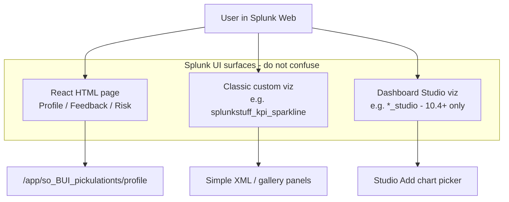
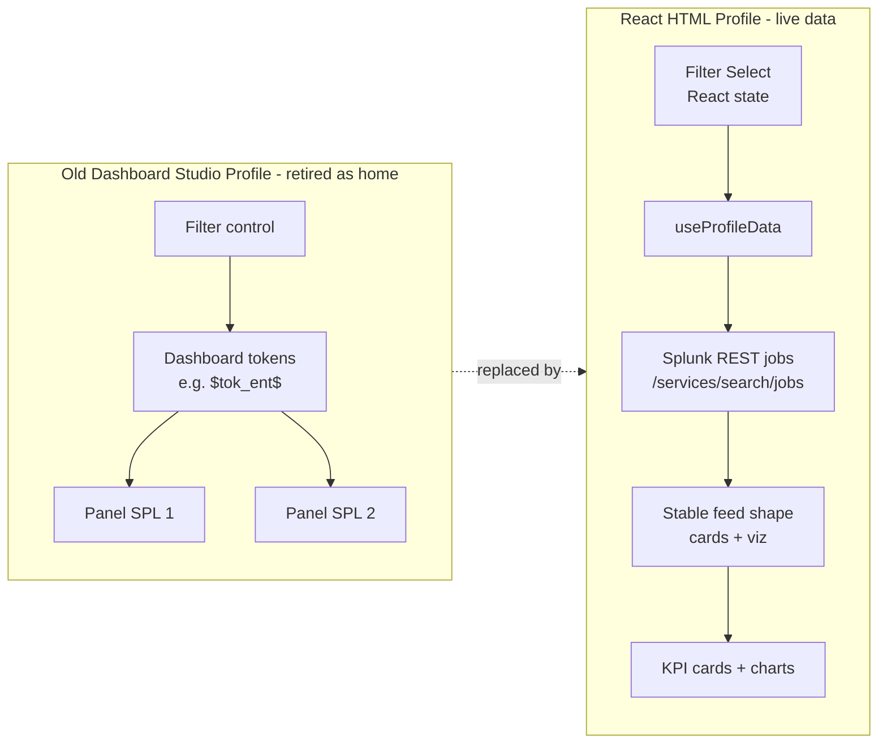
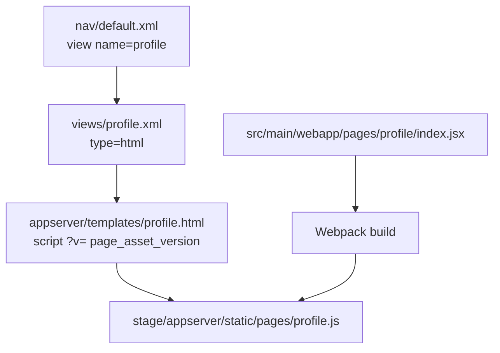
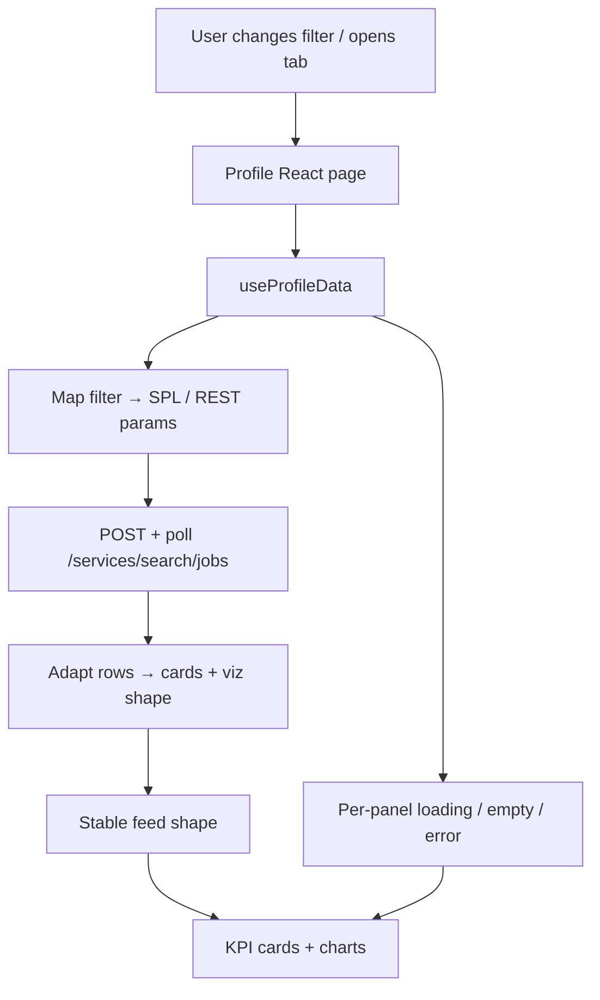
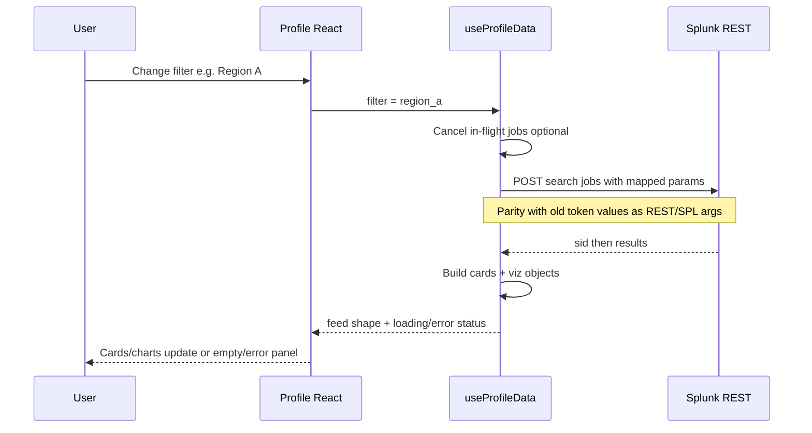

# Profile React — Full Architecture

**App:** `so_BUI_pickulationts`  
**Primary URL:** `/app/so_BUI_pickulationts/profile`  
**Related URL:** `/app/so_BUI_pickulationts/feedback`  
**Companion TDD:** [`PROFILE-REACT-APP-TDD.md`](./PROFILE-REACT-APP-TDD.md)  
**Audience:** Engineering, product, QA  

This document draws the **entire** Profile React architecture: packaging, page shell, **live Splunk REST data only**, Studio replacement, and how filter/actions map to Splunk jobs.

There is **no mock / demo fixture data path**. UI always consumes live search results shaped as `{ cards, viz }`.

---

## 1. Big picture (three Splunk surfaces)

Profile React is an **HTML React page**, not a Dashboard Studio dashboard and not a Classic custom viz panel.



| Box | Meaning |
|-----|---------|
| **React HTML page** | Full app screen you own: Webpack bundle + Mako template + `type="html"` view. Profile lives here. |
| **Classic custom viz** | Chart tile on Simple XML dashboards. Separate from Profile. |
| **Dashboard Studio viz** | Chart plugin inside Studio (`framework_type = studio_visualization`). Not used for Profile home. |
| **Profile URL** | Nav entry that loads the React Profile page. |

---

## 2. Studio (old) vs React Profile (target)



| Box | Meaning |
|-----|---------|
| **Filter control (Studio)** | Dropdown on the Studio dashboard. |
| **Dashboard tokens** | Studio writes `$tok_ent$`-style values; panel searches substitute them automatically. |
| **Panel SPL** | Each Studio panel’s search string. |
| **Filter Select (React)** | Same product idea, stored in React `useState` — **not** Studio tokens. |
| **useProfileData** | Live-only data hook: always runs REST searches, returns one UI contract. |
| **Splunk REST jobs** | Create + poll search jobs. Replaces Studio datasources. |
| **Stable feed shape** | `{ cards, viz }` object the UI understands (see §6). |
| **KPI cards + charts** | Visible Profile content (`LineChart`, summary cards, …). |

**One-line rule:**  
Studio = Filter → **tokens** → panel SPL.  
React = Filter → **state** → **REST jobs** → feed shape → UI.

---

## 3. Splunk packaging chain (how the page loads)



| Box | Meaning |
|-----|---------|
| **nav/default.xml** | App menu: Profile, Feedback, Resources, Documentation. |
| **profile.xml** | Declares an HTML view (not Studio, not Simple XML dashboard). |
| **profile.html** | Mako shell that loads Splunk config + the React bundle URL. |
| **page_asset_version / ?v=** | Cache-bust so browsers pick up new JS after deploy. |
| **profile.js** | Built Webpack output Splunk serves as static. |
| **index.jsx** | React entry: `@splunk/react-page/18`, theme, Profile UI. |
| **Webpack** | Compiles `pages/profile/` (+ Feedback) into `stage/.../pages/`. |

**Deploy reminder:** `$SPLUNK_HOME/etc/apps/so_BUI_pickulationts` → `packages/splunk-one/stage`. New views often need Splunk restart.

Same chain for Feedback: `feedback.xml` → `feedback.html` → `pages/feedback.js`.

---

## 4. Page composition (what’s on Profile)

```mermaid
flowchart TB
  Page[Profile React page navy shell]
  Header[Header: Profile H1 + logo mark]
  Tabs[TabBar: Profile | Metric]

  Page --> Header
  Page --> Tabs

  Tabs --> ProfTab[Profile tab]
  Tabs --> MetTab[Metric tab]

  ProfTab --> Toolbar[FILTER Select + Actions 1/2/3]
  ProfTab --> Cards[3 summary KPI cards]
  ProfTab --> Viz[3 viz cards]

  MetTab --> MetToolbar[Metric A / Metric B]
  MetTab --> MetViz[2 viz cards from live metric searches]

  Toolbar -->|Action 1| Modal1[Modal]
  Toolbar -->|Action 2| FeedbackNav[Navigate to Feedback]
  Toolbar -->|Action 3| Ext[External URL new tab]
  MetToolbar -->|Metric A| FeedbackNav
  MetToolbar -->|Metric B| Modal2[Modal]
```

| Box | Meaning |
|-----|---------|
| **Navy shell** | Full-page chrome `#0B1F3B` for Profile/Feedback. |
| **Header** | Title left, brand mark right. |
| **TabBar** | Profile vs Metric on one URL (no full reload). |
| **FILTER Select** | Keys mapped to SPL/REST params (e.g. region). |
| **Actions 1/2/3** | Modal / Feedback / external (labels may be renamed later). |
| **Summary KPI cards** | Driven by live `feed.cards`. |
| **Viz cards** | Driven by live `feed.viz` + shared viz components. |
| **Metric tab** | Live searches independent of Profile filter unless product later unifies. |
| **Feedback navigate** | In-app route to `/app/so_BUI_pickulationts/feedback`. |

---

## 5. Data architecture (live only)



| Box | Meaning |
|-----|---------|
| **useProfileData** | Owns fetch, cancellation, and shaping. **Always live** — no fixture branch. |
| **Map** | Same *meaning* as old `$tok_ent$`, as REST/SPL args — **not** Studio token bus. |
| **REST jobs** | Live searches; re-run when filter changes. |
| **Adapt** | Convert job results into `{ cards, viz }`. |
| **Stable feed shape** | UI contract; empty/error keep the shell intact. |
| **Panel states** | Spinner / empty / error per panel; never blank the whole page. |

### Filter change sequence



---

## 6. UI contract (stable)

Filter keys (product may remap labels/values for Studio parity):

| Value | Label |
|-------|-------|
| `all` | All |
| `region_a` | Region A |
| `region_b` | Region B |

Feed shape (live results must map into this):

```js
{
  cards: [{ title, value, delta }],
  viz: [{ subheader, tooltipText, values[], times[] }],
}
```

This is the React replacement for Studio datasources.

---

## 7. Main source files

| Area | Path |
|------|------|
| Profile entry | `src/main/webapp/pages/profile/index.jsx` |
| Styles / layout | `src/main/webapp/pages/profile/ProfileStyles.jsx` |
| Live data hook | `src/main/webapp/pages/profile/hooks/useProfileData.js` |
| Filter → SPL params | `src/main/webapp/pages/profile/filters/filtersToSplunkParams.js` |
| REST search client | `src/main/webapp/pages/profile/data/profileSearchClient.js` |
| Feed contract helpers | `src/main/webapp/pages/profile/profileContract.js` |
| Feedback entry | `src/main/webapp/pages/feedback/index.jsx` |
| Profile template | `appserver/templates/profile.html` |
| Feedback template | `appserver/templates/feedback.html` |
| Views | `default/data/ui/views/profile.xml`, `feedback.xml` |
| Nav | `default/data/ui/nav/default.xml` |
| Shared viz | `src/main/webapp/components/visualizations/` |
| Built bundles | `stage/appserver/static/pages/profile.js`, `feedback.js` |

Standalone transfer package (optional): `packages/profile-react-prof1/`.

---

## 8. Related stories (data workstream)

| Story | Role in this architecture |
|-------|---------------------------|
| **PROF-1** | Packaging + filter + embedded content wired to live data |
| **PROF-40** | `useProfileData` live REST (no mock mode) |
| **PROF-41** | Filter → SPL / REST params (not Studio tokens) |
| **PROF-42** | Per-panel loading / empty / error |
| **PROF-43** | Optional time range on toolbar |

---

## 9. Build / see it

```bash
cd packages/splunk-one
yarn build          # or yarn start for watch
# bump page_asset_version in profile.html / feedback.html
# ensure symlink: $SPLUNK_HOME/etc/apps/so_BUI_pickulationts → stage
# restart Splunk if views are new; hard-refresh browser
```

```text
http://127.0.0.1:8001/en-US/app/so_BUI_pickulationts/profile
http://127.0.0.1:8001/en-US/app/so_BUI_pickulationts/feedback
```

---

## 10. Scrum one-liner

> Profile is one React HTML page that replaced Studio. Filters are React state. Data always loads via Splunk REST search jobs (PROF-40/41)—we do **not** pass Dashboard Studio tokens and we do **not** ship mock fixtures. Live rows map into the stable `cards` + `viz` shape.
