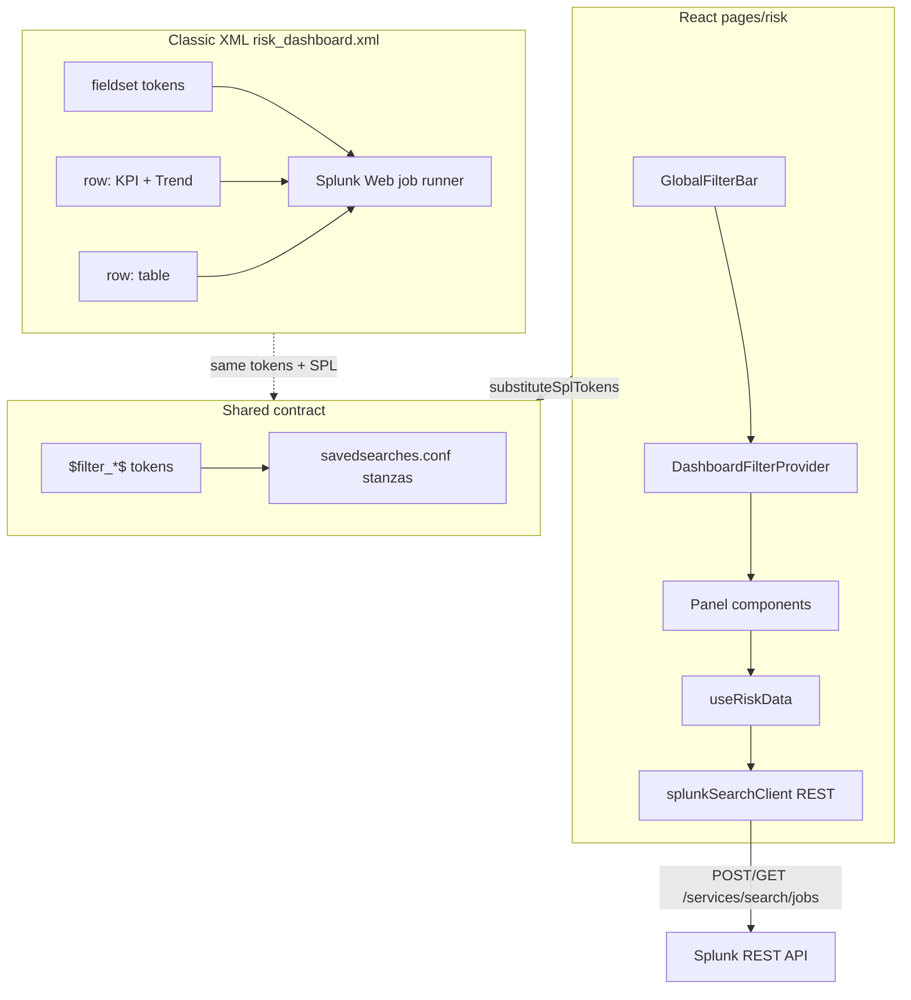
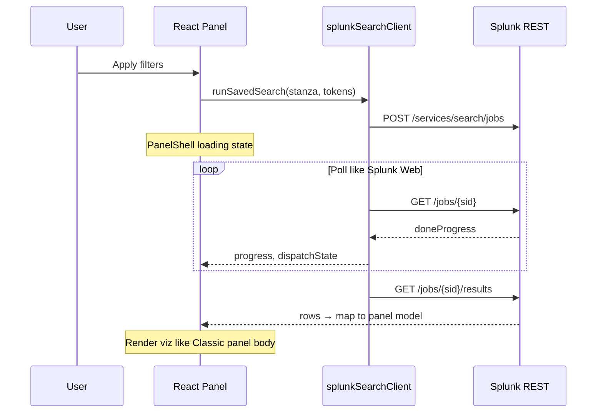

# Technical Design Document (TDD)

## Risk Dashboard — React App Modernization of Splunk Classic XML

**Version:** 1.1  
**Status:** Implemented  
**Audience:** Engineering, Splunk admins, product  
**App id:** `so_BUI_pickulationts`  
**Classic source:** [`risk_dashboard.xml`](src/main/resources/splunk/default/data/ui/views/risk_dashboard.xml)  
**React target:** [`risk.xml`](src/main/resources/splunk/default/data/ui/views/risk.xml) → `pages/risk/`  
**Related docs:** [RISK-DASHBOARD.md](./RISK-DASHBOARD.md) (operational guide)  
**Last updated:** 2026-06-22

---

## 1. Executive summary

The **Risk Anomaly Detection** React page is a **modernization of an existing Splunk Classic XML dashboard**. The Classic dashboard (`risk_dashboard.xml`) is the authoritative source for layout, tokens, saved searches, and custom visualization types. The React app re-implements that dashboard inside a Splunk HTML view, then extends it with dependent filters, additional panels, and entity drilldown.

This TDD documents two parity requirements between Classic and React:

1. **Search job UX** — Classic dashboards show Splunk Web’s native panel loading states (“Search is waiting for input…”, job progress). The React app must replicate that behavior when dispatching the same SPL via REST (`?data=splunk`).
2. **Panel sizing and layout** — Classic row 1 is two half-width panels: **Total Risk Score** (`splunkstuff_kpi_sparkline`) and **Risk Trend** (`fixed_loaded_line`). The React app must match that visual weight (taller KPI tiles, side-by-side top row) rather than cramming four narrow KPI cards into one row.

**Strategy:** Keep Classic XML as the token and SPL contract; build React as the primary UX surface that consumes the same `$filter_*$` tokens and saved search stanzas.

---

## 2. Classic XML source dashboard

### 2.1 Dashboard definition

File: [`risk_dashboard.xml`](src/main/resources/splunk/default/data/ui/views/risk_dashboard.xml)

```xml
<dashboard version="1.1">
    <label>Risk Dashboard (Classic)</label>
    <fieldset submitButton="true" autoRun="true">
        <!-- tokens: filter_earliest, filter_latest, filter_bu, filter_domain, filter_severity -->
    </fieldset>
    <row>
        <panel><!-- Total Risk Score → splunkstuff_kpi_sparkline --></panel>
        <panel><!-- Risk Trend → fixed_loaded_line --></panel>
    </row>
    <row>
        <panel><!-- Anomaly data → table --></panel>
    </row>
</dashboard>
```

### 2.2 What Classic provides for free

| Classic feature | Behavior |
|-----------------|----------|
| `<fieldset>` inputs | Token inputs rendered by Splunk Web; `$token$` substitution in panel SPL |
| `submitButton="true"` | User clicks Search/Submit to refresh all panels |
| `autoRun="true"` | Initial dispatch on dashboard load |
| `<search>` + `<viz>` | Splunk dispatches jobs, shows progress, renders custom viz or table |
| Panel `<title>` | Native panel chrome |
| Job lifecycle | Queued → Running → Done; Splunk Web handles spinner/progress internally |

### 2.3 What Classic cannot do (motivation for React)

| Limitation | React replacement |
|------------|-------------------|
| Independent dropdowns only; no cascade | `GlobalFilterBar` + `filterCatalog.js` dependency graph (F1–F6) |
| No React-managed filter state | `DashboardFilterProvider` stores draft/applied filters locally |
| No entity drilldown drawer | `EntityDetailDrawer` + local `entityFocus` state |
| Only 3 panels in MVP XML | Extended panels P2–P8 in React (KPIs, heatmaps, calendar) |
| “Search is waiting for input” when tokens unset | Explicit Apply + mock fixtures for dev without indexes |

---

## 3. Classic → React migration map

### 3.1 View registration

| Classic | React |
|---------|-------|
| `<dashboard>` in `default/data/ui/views/risk_dashboard.xml` | `<view type="html" template="…/risk.html">` in `risk.xml` |
| Splunk renders rows/panels | `risk.html` loads webpack bundle `pages/risk.js` |
| Nav: implicit dashboard view | Nav: `<view name="risk" />` in `default.xml` |

### 3.2 Filter fieldset → GlobalFilterBar

| Classic XML input | Token | React local state |
|-------------------|-------|-------------------|
| `<input type="time" token="filter_earliest">` | `$filter_earliest$` | `dateRange.earliest` |
| `<input type="time" token="filter_latest">` | `$filter_latest$` | `dateRange.latest` |
| `<input type="dropdown" token="filter_bu">` | `$filter_bu$` | `businessUnit` |
| `<input type="dropdown" token="filter_domain">` | `$filter_domain$` | `domains` |
| — | `$filter_entity_type$` | `entityType` *(React-only)* |
| — | `$filter_entity_ids$` | `entityIds` *(React-only)* |
| `<input type="dropdown" token="filter_severity">` | `$filter_severity$` | `severities` |
| — | `$filter_entity_id$` | `entityFocus` *(React-only)* |

Serializer: [`filtersToSplunkParams.js`](src/main/webapp/pages/risk/filters/filtersToSplunkParams.js) — same token names used in `savedsearches.conf` and Classic panel `<earliest>` / `<latest>` blocks.

**Submit behavior:**

| Classic | React |
|---------|-------|
| Fieldset Submit refreshes all panels | **Apply filters** commits draft → applied, bumps `refreshGeneration` |
| Reset not in Classic MVP | **Reset** restores `createDefaultFilters()`, syncs URL, aborts in-flight jobs |

### 3.3 Row / panel / viz → React component

| Classic row | Classic panel | Classic viz / element | React component | Saved search |
|-------------|---------------|----------------------|-----------------|--------------|
| 1 | Total Risk Score | `splunkstuff_kpi_sparkline` | `RiskScoreKpi` → `NewSingleValue` | `risk_summary` |
| 1 | Risk Trend | `fixed_loaded_line` | `RiskTrendChart` → `LineChart` | `risk_timeseries` |
| 2 | Anomaly data | `<table>` | `AnomalyTable` | `risk_anomalies` |
| — | *(extended)* | — | `AnomalyCountKpi`, `SeverityKpi`, `MttdKpi` | `risk_summary` |
| — | *(extended)* | — | `EntityCategoryHeatmap` | `risk_heatmap_entity_category` |
| — | *(extended)* | — | `DomainTreemap` | `risk_breakdown_domain` |
| — | *(extended)* | — | `CalendarHeatmap` | `risk_calendar_heatmap` |
| — | *(extended)* | — | `EntityDetailDrawer` | `risk_entity_detail` |

### 3.4 Custom viz → React visualization parity

| Classic custom viz | React equivalent | Notes |
|--------------------|------------------|-------|
| `splunkstuff_kpi_sparkline` | `NewSingleValue` + `FixedSparkline` | Classic fills panel height; React uses 150px tile, sparkline **below** value |
| `fixed_loaded_line` | `LineChart` with `fillContainer` | Classic panel-width responsive; React uses `ResizeObserver` + measured width |
| Native `<table>` | `@splunk/react-ui/Table` | Same column semantics; React adds entity link drilldown |

Classic KPI viz uses `height: 100%` of the panel body. React `ResponsiveKpiValue` measures container width and passes numeric pixels to match that fill behavior.

---

## 4. Problem statement (parity gaps)

The first React implementation diverged from Classic in ways users noticed immediately:

### 4.1 Missing Classic search UX

Classic panels show Splunk Web job states automatically. The React app initially set `loading: true` in Splunk mode but **never dispatched searches**, leaving panels stuck or showing nothing. For heavy searches, users had no equivalent of Classic’s implicit progress feedback.

### 4.2 Layout drift from Classic row 1

Classic row 1 is **two equal panels**. The React page used a **four-up KPI scorecard**, making tiles narrow and unlike the Classic `splunkstuff_kpi_sparkline` presentation.

### 4.3 Data binding errors

Classic KPI viz binds `_time` + `value` series to the sparkline component. React mistakenly fed MTTD sparkline data into Total Risk Score and defaulted `unit: '%'`, producing **4%** instead of **847**.

---

## 5. Architecture — React as Classic dashboard runtime



### 5.1 Dual runtime modes

| Mode | URL | Behavior | Classic equivalent |
|------|-----|----------|-------------------|
| **Mock** | `/app/…/risk` | Client fixtures, instant render | N/A (dev-only) |
| **Splunk** | `/app/…/risk?data=splunk` | REST job dispatch + poll | Classic panel search dispatch |

Mock mode exists because Classic always needs Splunk to run SPL; React can demo UI without indexes using `riskFixtures.js`.

### 5.2 Search progress — replicating Classic panel loading

When React dispatches via REST, it must surface the same signals Classic gets from `/services/search/jobs/{sid}`:

```typescript
interface JobProgress {
  progress: number;        // content.doneProgress × 100
  dispatchState: string;   // QUEUED | RUNNING | FINALIZING | DONE | FAILED
  eventCount?: number;
  isDone: boolean;
  isFailed: boolean;
}
```

**Implementation:**

| Classic (implicit) | React (explicit) |
|--------------------|------------------|
| Splunk Web spinner on panel | `PanelShell` → `WaitSpinner` |
| Job progress bar | `PanelShell` → `@splunk/react-ui/Progress` |
| Cancel on new submit | `AbortController` on Apply/Reset/unmount |
| 5+ min searches | `maxWaitMs: 300000` (Classic has no hard 10s cap) |

**Sequence (Splunk mode):**



Files: [`splunkSearchClient.js`](src/main/webapp/pages/risk/data/splunkSearchClient.js), [`useRiskData.js`](src/main/webapp/pages/risk/hooks/useRiskData.js), [`PanelShell.jsx`](src/main/webapp/pages/risk/panels/PanelShell.jsx)

---

## 6. Layout specification — Classic row parity

### 6.1 Target grid (Classic row 1 + extensions)

Classic MVP has 2 rows. React preserves row 1 exactly, inserts a secondary KPI row (from extended `risk_summary` stanza), then adds analytics panels:

```
┌─────────────────────────────────────────────────────────────┐
│ GlobalFilterBar          ← Classic <fieldset> + extensions   │
├──────────────────────────┬──────────────────────────────────┤
│ Total Risk Score         │ Risk Score Over Time               │
│ ← Classic row 1 panel 1  │ ← Classic row 1 panel 2            │
│ splunkstuff_kpi_sparkline│ fixed_loaded_line                  │
├──────────────┬───────────┴──────────┬───────────────────────┤
│ Active Anom. │ Critical / High      │ MTTD                    │
│ ← risk_summary extension (React)                             │
├──────────────┴──────────────────────┴───────────────────────┤
│ Heatmap │ Domain │ Calendar │ Table ← Classic row 2 extended │
└─────────────────────────────────────────────────────────────┘
```

[`index.jsx`](src/main/webapp/pages/risk/index.jsx):

```jsx
<TwoColumnRow>           {/* Classic <row> row 1 */}
  <RiskScoreKpi />
  <RiskTrendChart />
</TwoColumnRow>
<ScorecardRow>           {/* React extension from risk_summary */}
  <AnomalyCountKpi />
  <SeverityKpi />
  <MttdKpi />
</ScorecardRow>
```

### 6.2 KPI tile sizing (match Classic panel body)

Classic `splunkstuff_kpi_sparkline` expands to panel height. React constants in [`kpiWidgetCommon.js`](src/main/webapp/pages/risk/panels/kpiWidgetCommon.js):

| Property | Value | Classic reference |
|----------|-------|-------------------|
| Tile height | 150px | Full panel body height |
| `sparklineLayout` | `'below'` | Classic separates value block from sparkline area |
| `sparkHeight` | 52px | Visible trend at half-panel width |
| `majorFontSize` | 36 | Matches Classic KPI prominence |
| Trend chart height | 240px | Balances with KPI tile + panel title |

`ResponsiveKpiValue` uses `ResizeObserver` — equivalent to Classic viz reading panel width from DOM.

### 6.3 KPI data binding (Classic `_time`/`value` semantics)

| Panel | Classic SPL shape | React feed | Unit |
|-------|-------------------|------------|------|
| Total Risk Score | time series → `value` | `[previousTotalRiskScore, totalRiskScore]` | none |
| Active Anomalies | summary fields | `[previousAnomalyCount, anomalyCount]` | none |
| MTTD | `mttd_sparkline` string | `sparklineMttd`, major = `meanTimeToDetectHours` | `h` |
| Risk Trend | `_time`, `value` / `risk_score` | `mockTimeSeries` / `risk_timeseries` rows | none |

In-viz subheader shows **delta only** `(+12%)` — panel title comes from `PanelShell` (Classic `<title>` equivalent).

---

## 7. Token and saved search contract

Both Classic and React must use identical tokens. Stanzas in [`savedsearches.conf`](src/main/resources/splunk/default/savedsearches.conf):

| Stanza | Classic panel | React panel(s) |
|--------|---------------|----------------|
| `risk_summary` | *(inline in Classic MVP)* | P1, P2, P3, P4 |
| `risk_timeseries` | `risk_classic_trend` inline SPL | P5 |
| `risk_anomalies` | table row 2 | P9 |
| `risk_heatmap_entity_category` | — | P6 |
| `risk_breakdown_domain` | — | P7 |
| `risk_calendar_heatmap` | — | P8 |
| `risk_entity_detail` | — | Entity drawer |

Classic MVP embeds SPL inline; React prefers saved search stanzas with `$filter_*$` substitution — same tokens either way.

---

## 8. Component responsibilities

| Classic concept | React file | Role |
|-----------------|------------|------|
| Dashboard shell | `index.jsx` | Page composition |
| Panel chrome | `PanelShell.jsx` | `<panel><title>` + loading/error body |
| Fieldset | `GlobalFilterBar.jsx` | Token inputs + Apply/Reset |
| Token state | `DashboardFilterProvider.jsx` | Draft/applied; replaces `$token$` at dispatch |
| Panel search | `useRiskData.js` | One hook per panel; maps REST rows → view model |
| Job runner | `splunkSearchClient.js` | REST equivalent of Splunk Web dispatch |
| KPI viz | `ResponsiveKpiValue.jsx` + `NewSingleValue` | `splunkstuff_kpi_sparkline` |
| Line viz | `RiskTrendChart.jsx` + `LineChart` | `fixed_loaded_line` |

---

## 9. Version strategy

| Splunk | Classic dashboard | React page |
|--------|--------------------|------------|
| **9.4** | `risk_dashboard.xml` + custom vizs | Primary UX; REST progress |
| **10.2** | Same; conf packaging rules | Same React bundle |
| **10.4** | Optional Studio KPI tiles | React unchanged; Studio uses same tokens |

Classic remains available at `/risk_dashboard` as fallback and SPL reference. React at `/risk` is the superset.

---

## 10. Testing — Classic parity checklist

### 10.1 Unit tests

```bash
yarn test:risk   # from packages/splunk-one
```

| Test file | Validates |
|-----------|-----------|
| `splunkSearchClient.test.mjs` | Job progress parsing; abort (Classic “new submit cancels old job”) |
| `filterCatalog.test.mjs` | Token cascade; runtime mode parsing; local filter behavior |

### 10.2 Side-by-side acceptance

Open Classic and React in two tabs; compare after Apply:

| Check | Classic (`/risk_dashboard`) | React (`/risk`) |
|-------|----------------------------|-----------------|
| Row 1 layout | Two equal panels | Two equal columns |
| KPI readable at panel width | Full-height sparkline viz | 150px tile, no text overlap |
| Trend chart width | Panel-width line chart | Responsive `LineChart` |
| Submit refreshes panels | Fieldset Submit | Apply filters |
| Loading on heavy search | Splunk Web default | Spinner + progress bar (`?data=splunk`) |
| P1 value | ~800+ from inline SPL | **847** from fixture / `risk_summary` |

---

## 11. Operational notes

Build and cache: see [RISK-DASHBOARD.md](./RISK-DASHBOARD.md).

| Surface | URL |
|---------|-----|
| React (primary) | `/en-US/app/so_BUI_pickulationts/risk` |
| React + REST jobs | append `?data=splunk` |
| Classic (source) | `/en-US/app/so_BUI_pickulationts/risk_dashboard` |

After UI changes: `yarn build` → hard refresh `risk.js` → restart Splunk if needed.

---

## 12. Future work

| Item | Classic baseline | React enhancement |
|------|------------------|-------------------|
| Global refresh indicator | Splunk Web dashboard-level progress | Optional banner in `GlobalFilterBar` |
| Dedupe `risk_summary` | Classic runs one search per panel | Share one job across P1–P4 |
| Real indexes | Replace `makeresults` in XML + conf | Same SPL in both surfaces |
| Full Classic parity test | Visual diff Classic vs React row 1 | Playwright screenshot compare |

---

## 13. File index

| Path | Classic role | React role |
|------|--------------|------------|
| `default/data/ui/views/risk_dashboard.xml` | Source dashboard | Reference / fallback |
| `default/data/ui/views/risk.xml` | — | React view registration |
| `appserver/templates/risk.html` | — | Bundle loader |
| `default/savedsearches.conf` | Token-driven SPL | Shared with React REST client |
| `pages/risk/index.jsx` | `<dashboard>` structure | Page layout |
| `pages/risk/filters/GlobalFilterBar.jsx` | `<fieldset>` | Filter UI |
| `pages/risk/data/splunkSearchClient.js` | Splunk Web job runner | REST job runner |
| `pages/risk/panels/PanelShell.jsx` | `<panel>` chrome | Panel + progress UI |
| `pages/risk/panels/RiskScoreKpi.jsx` | KPI panel 1 | `splunkstuff_kpi_sparkline` |
| `pages/risk/panels/RiskTrendChart.jsx` | Trend panel 2 | `fixed_loaded_line` |
| `appserver/static/visualizations/splunkstuff_kpi_sparkline/` | Classic viz bundle | Parity reference for sizing |
