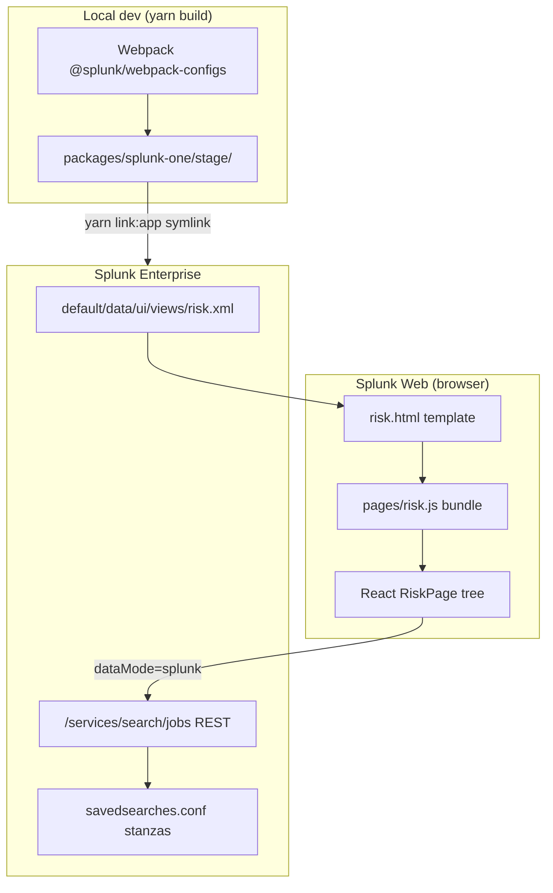
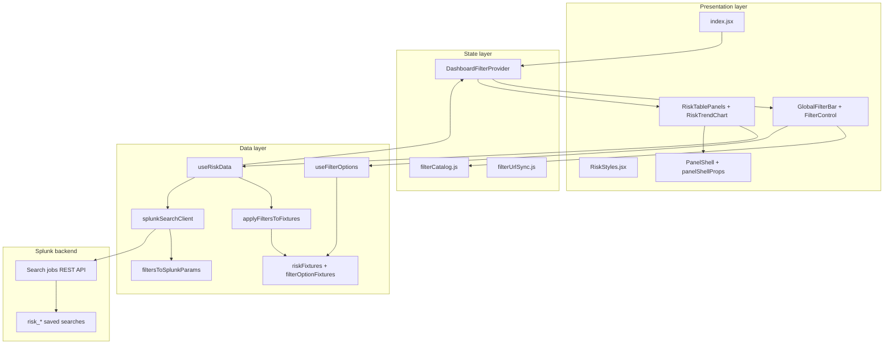
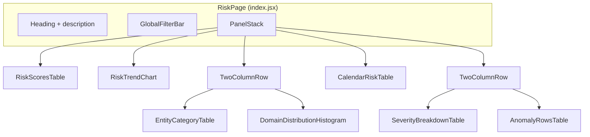
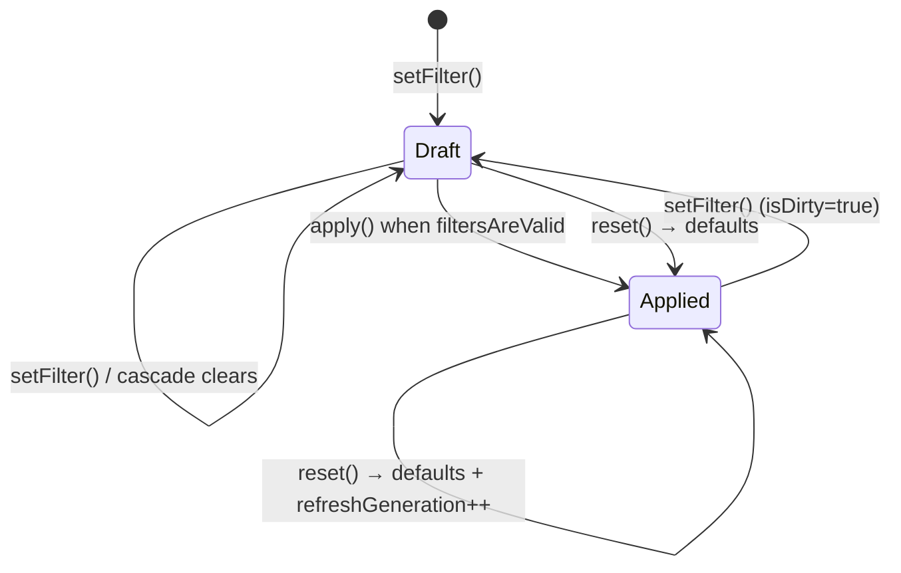
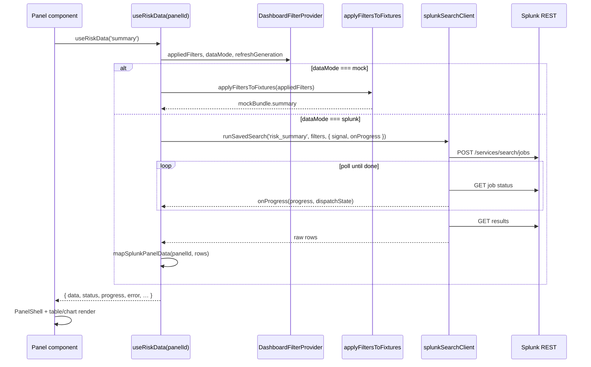

# Risk Page — Architectural Manifest

**App:** `so_BUI_pickulationts` (Splunk Stuff local dev)  
**Surface:** React HTML page — **Risk Anomaly Detection**  
**Source root:** `src/main/webapp/pages/risk/`  
**Version:** 1.0 (post table-layout cleanup, 19 source modules)  
**Audience:** Engineering, Splunk admins, reviewers

---

## 1. Purpose

The React risk page is a **table-first investigation dashboard** for risk-score movement, domain concentration, and active anomaly clusters. It replaces the Classic XML dashboard (`risk_dashboard`) as the primary modern surface while sharing the same `$filter_*$` token contract and saved-search stanzas.

Design goals:

- **Single filter bar** drives all panels (draft → apply → refresh).
- **Dual data mode:** mock fixtures (default) or live Splunk REST (`?data=splunk`).
- **Panel isolation:** each panel owns its UI; data comes from one hook (`useRiskData`).
- **Splunk alignment:** tokens, saved searches, and Classic XML stay compatible.

---

## 2. System context



| Surface | URL path | Notes |
|---------|----------|-------|
| **React (this manifest)** | `/app/so_BUI_pickulationts/risk` | Primary; loads `risk.js` |
| Classic XML | `/app/so_BUI_pickulationts/risk_dashboard` | Legacy Simple XML + custom vizs |
| Splunk REST | `window.__splunkd_partials__.splunkd.rootUrl` | Used when `?data=splunk` |

**Runtime switch:** only `?data=splunk` is read from the URL. Filter values live in React state, not shareable URL params.

---

## 3. Layered architecture



| Layer | Responsibility | Must not |
|-------|----------------|----------|
| **Presentation** | Layout, tables, chart, loading UI | Call Splunk REST directly |
| **State** | Draft/applied filters, refresh generation | Fetch panel data |
| **Data** | Mock filtering, SPL dispatch, row mapping | Render UI |
| **Splunk** | Execute tokenized SPL, return rows | Know React component tree |

---

## 4. Module manifest (19 files)

Every file under `pages/risk/` and its role:

```
pages/risk/
├── index.jsx                          # Entry: Splunk react-page bootstrap + page layout
├── RiskStyles.jsx                     # Layout primitives: RiskPageContainer, PanelStack, TwoColumnRow
│
├── context/
│   └── DashboardFilterProvider.jsx    # Draft/applied filter state, apply/reset, refreshGeneration
│
├── filters/
│   ├── filterCatalog.js               # FILTER_IDS F1–F7, presets, validation, cascade clears
│   ├── filterUrlSync.js               # parseFiltersFromUrl (?data=splunk only)
│   ├── filtersToSplunkParams.js       # AppliedFilters → $filter_*$ tokens + REST bounds
│   ├── FilterControl.jsx              # Per-filter UI (incl. TimeRangeSelectorPanel)
│   └── GlobalFilterBar.jsx            # Filter card: controls, Submit, Reset, applied chips
│
├── hooks/
│   ├── useRiskData.js                 # Panel data hook: mock | splunk, mappers, progress
│   ├── useFilterOptions.js            # Cascading dropdown options (mock; cached)
│   └── useContainerSize.js            # ResizeObserver width for RiskTrendChart
│
├── data/
│   ├── riskFixtures.js                # Static mock datasets (summary, timeseries, tables, …)
│   ├── filterOptionFixtures.js        # Mock dropdown option lists
│   ├── applyFiltersToFixtures.js      # Client-side mock filtering + summary scaling
│   └── splunkSearchClient.js          # REST job create → poll → results; SEARCH_TEMPLATES
│
└── panels/
    ├── PanelShell.jsx                 # Card wrapper: loading progress, error, empty
    ├── panelShellProps.js             # useRiskData → PanelShell prop adapter
    ├── RiskTablePanels.jsx            # Six table panels + EmptyAwarePanel + RiskDataTable
    └── RiskTrendChart.jsx             # LineChart time series + anomaly markers
```

### 4.1 External dependencies (shared app code)

| Import | From | Used by |
|--------|------|---------|
| `LineChart` | `components/visualizations/LineChart` | `RiskTrendChart` |
| `@splunk/react-page/18` | Splunk UI Toolkit | `index.jsx` |
| `@splunk/react-ui/*` | Splunk React UI | Filters, tables, cards, progress |

---

## 5. Page composition



Visual order matches Classic panel intent but renders **tables** instead of KPI sparklines / heatmap grids.

---

## 6. Filter system

### 6.1 Filter IDs

| ID | Field | Type | Depends on | Clears |
|----|-------|------|------------|--------|
| F1 | `dateRange` | dateRange | — | — |
| F2 | `businessUnit` | single | F1 | F3, F4, F5 |
| F3 | `domains` | multi | F1, F2 | F4, F5 |
| F4 | `entityType` | single | F1, F2, F3 | F5 |
| F5 | `entityIds` | multi | F1–F4 | — |
| F6 | `severities` | multi | F1 | — |
| F7 | `hideEmptyPanels` | boolean | — | — |

### 6.2 Draft / applied lifecycle



**Refresh signal:** `refreshGeneration` increments on `apply()` and `reset()`. `useRiskData` depends on `appliedFilters` + `refreshGeneration` to re-fetch in splunk mode and re-filter mocks.

**Validation (`filtersAreValid`):**

- `dateRange.from` and `dateRange.to` required
- If `entityIds` non-empty, `entityType` required

### 6.3 Splunk token mapping

Implementation: [`filtersToSplunkParams.js`](src/main/webapp/pages/risk/filters/filtersToSplunkParams.js)

| Token | React field | Empty sentinel |
|-------|-------------|----------------|
| `$filter_earliest$` | `dateRange.earliest` | — |
| `$filter_latest$` | `dateRange.latest` | — |
| `$filter_bu$` | `businessUnit` | `*` |
| `$filter_domain$` | `domains` (joined) | `*` |
| `$filter_entity_type$` | `entityType` | `*` |
| `$filter_entity_ids$` | `entityIds` (joined) | `*` |
| `$filter_severity$` | `severities` (joined) | `*` |
| `$filter_entity_id$` | — | always `*` (no entity drilldown) |

---

## 7. Data pipeline

### 7.1 End-to-end flow



### 7.2 Panel registry

| panelId | Saved search | UI component | Data shape |
|---------|--------------|--------------|------------|
| `summary` | `risk_summary` | `RiskScoresTable` | `{ totalRiskScore, deltaPercent, anomalyCount, severityCounts, meanTimeToDetectHours, … }` |
| `timeseries` | `risk_timeseries` | `RiskTrendChart` | `[{ timestamp, riskScore, baselineScore, isAnomaly, entityId }]` |
| `heatmap` | `risk_heatmap_entity_category` | `EntityCategoryTable` | `[{ rowKey, colKey, value, entityIds }]` |
| `domain` | `risk_breakdown_domain` | `DomainDistributionHistogram` | `[{ domain, score }]` |
| `calendar` | `risk_calendar_heatmap` | `CalendarRiskTable` | `[{ rowKey: day, colKey: hour, value }]` |
| `anomalies` | `risk_anomalies` | `AnomalyRowsTable`, `SeverityBreakdownTable`* | `[{ id, entityName, domain, severity, riskScore, … }]` |

\* `SeverityBreakdownTable` reads `summary.severityCounts`, not the anomalies panelId.

### 7.3 Mock vs Splunk parity

| Concern | Mock path | Splunk path |
|---------|-----------|-------------|
| Source | `riskFixtures.js` | `SEARCH_TEMPLATES` in `splunkSearchClient.js` (mirrors `savedsearches.conf`) |
| Filtering | `applyFiltersToFixtures` (client) | SPL token substitution in search |
| Progress UI | Instant (`status: ok`) | `WaitSpinner` + `Progress` via `PanelShell` |
| Cancellation | N/A | `AbortController` on filter change / unmount |

---

## 8. Panel presentation contract

All panels follow the same shell pattern:

1. `const riskData = useRiskData('<panelId>')`
2. `<PanelShell title="…" {...panelShellPropsFromRiskData(riskData)} …>`
3. Optional `hideEmptyPanels` guard (reads `appliedFilters.hideEmptyPanels`)

**PanelShell states:**

| `status` | UI |
|----------|-----|
| `loading` | WaitSpinner + optional progress bar + dispatch state label |
| `error` | Red error message from `error.message` |
| `ok` + `emptyState` | Muted empty copy (no children) |
| `ok` | Renders `children` (table or chart) |

---

## 9. Splunk delivery manifest

### 9.1 Build outputs

| Artifact | Path (after `yarn build`) |
|----------|---------------------------|
| Page bundle | `stage/appserver/static/pages/risk.js` |
| HTML template | `stage/appserver/templates/risk.html` |
| View registration | `stage/default/data/ui/views/risk.xml` |
| Saved searches | `stage/default/savedsearches.conf` |
| App symlink target | `$SPLUNK_HOME/etc/apps/so_BUI_pickulationts` → `stage/` |

### 9.2 Cache busting

`risk.html` loads the bundle with a version query string:

```html
<script src="…/pages/risk.js?v=202606251714"></script>
```

After UI changes: `yarn build`, bump `page_asset_version` in `risk.html` if needed, hard refresh browser.

### 9.3 Active saved-search stanzas (React panels)

| Stanza | Used by React page |
|--------|-------------------|
| `risk_summary` | Yes |
| `risk_timeseries` | Yes |
| `risk_heatmap_entity_category` | Yes |
| `risk_breakdown_domain` | Yes |
| `risk_calendar_heatmap` | Yes |
| `risk_anomalies` | Yes |
| `risk_filter_options_bu` | Planned (options still mock) |
| `risk_filter_options_domain` | Planned (options still mock) |
| `risk_entity_detail` | **No** (removed with entity drilldown) |

Replace `makeresults` SPL with real `index=risk_*` queries when indexes exist. Keep token names unchanged for Classic/Studio compatibility.

---

## 10. Data modes

| Mode | URL | Behavior |
|------|-----|----------|
| **mock** (default) | `/risk` | Instant fixture data; `applyFiltersToFixtures` narrows rows |
| **splunk** | `/risk?data=splunk` | Each panel dispatches its own REST search job |

Toggle persists for the session via React state initialized from URL on load. Reset preserves current `dataMode`.

---

## 11. Testing

| Test file | Scope |
|-----------|-------|
| `test/risk/filterCatalog.test.mjs` | Cascade clears, validation, URL parse, mock filtering |
| `test/risk/splunkSearchClient.test.mjs` | `parseJobProgress`, abort, unknown search |
| `test/playwright/risk-dashboard.spec.ts` | Build artifacts: `risk.js`, view XML, classic dashboard |
| `bin/verify-risk-dashboard.js` | Post-build file presence + nav registration |

Run: `yarn test:risk`, `yarn verify:risk-dashboard`

---

## 12. Extension guide

### Add a new panel

1. Add `panelId` → saved search mapping in `useRiskData.js` (`PANEL_SEARCH_MAP` + mapper).
2. Add SPL template to `splunkSearchClient.js` `SEARCH_TEMPLATES` and `savedsearches.conf`.
3. Create panel component using `useRiskData` + `PanelShell`.
4. Register in `index.jsx` layout.
5. Add mock rows to `riskFixtures.js` + filtering in `applyFiltersToFixtures.js` if needed.

### Add a new filter

1. Add `FILTER_IDS` entry and `FILTER_CATALOG` row in `filterCatalog.js`.
2. Handle in `setFilterValue` + `createDefaultFilters`.
3. Map token in `filtersToSplunkParams.js`.
4. Add control in `GlobalFilterBar` via `FilterControl`.
5. Extend mock fixtures / SPL templates to honor the token.

### Wire filter dropdowns to Splunk

Replace mock branch in `useFilterOptions.js` with `runSavedSearch('risk_filter_options_*', …)`. Stanzas already exist in `savedsearches.conf`.

---

## 13. Related documentation

| Document | Focus |
|----------|-------|
| [`RISK-DASHBOARD.md`](RISK-DASHBOARD.md) | Ops guide: URLs, tokens, cache, Studio |
| [`RISK-DASHBOARD-UX-TDD.md`](RISK-DASHBOARD-UX-TDD.md) | Classic → React modernization spec (includes legacy KPI/drawer targets) |
| [`SPLUNK_DEV.md`](../../SPLUNK_DEV.md) | Local build, link, watch workflow |

---

## 14. Architectural invariants

1. **One filter bar, many panels** — panels never own filter state.
2. **Applied filters drive data** — draft changes do not refresh panels until Submit.
3. **PanelId is the data key** — UI components do not import `splunkSearchClient` directly.
4. **Token contract is shared** — React, Classic XML, and Studio must use the same `$filter_*$` names.
5. **Presentation is table/chart native** — no Splunk dashboard viz embeds inside the React page; custom vizs remain on Classic/Studio surfaces.

---

*Generated to reflect the cleaned 19-file `pages/risk/` tree. Update this manifest when panel layout, filter schema, or Splunk integration boundaries change.*
